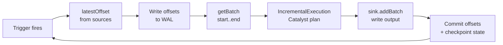
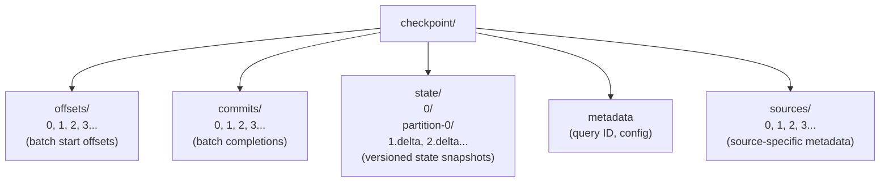

# Spark Structured Streaming
## Incremental Processing on a Batch Engine

**Treating streams as unbounded tables**

Data Engineering — Lecture 4

<!-- Speaker: Welcome students. Today we bridge the gap between batch and streaming — Spark's answer is to pretend there is no gap at all. -->

<!-- Notes:
This lecture builds on students' existing knowledge of Spark SQL, DataFrames, and the Catalyst optimizer.
The central thesis is that Spark Structured Streaming eliminates the traditional API boundary between
batch and streaming by modeling streams as unbounded tables. Students should leave understanding both
the elegance of this abstraction and its practical limitations (latency floor, checkpoint rigidity,
small-file problems). The running example throughout is a clickstream pipeline reading from Kafka,
computing windowed page-view counts, and writing to Apache Iceberg.
-->

---

## Agenda

1. Why unify batch and streaming?
2. The unbounded table model
3. Micro-batch execution engine
4. Exactly-once guarantees and checkpointing
5. Running example: clickstream pipeline
6. Watermarks and late data
7. Stateful operations and state stores
8. Micro-batch vs. Continuous vs. Flink
9. Operational pitfalls and table sinks
10. Summary and key takeaways

<!-- Speaker: Here is our roadmap. We start from the conceptual model, drill into execution mechanics, then surface with operational realities. -->

<!-- Notes:
The lecture is structured in a funnel pattern: conceptual model first (what the user sees),
then execution internals (what the engine does), then operational concerns (what breaks in production).
This ordering mirrors how engineers encounter Structured Streaming — the API looks deceptively simple,
but production reliability requires understanding the engine underneath.
-->

---

## Motivation — Why Unify Batch and Streaming?

- Traditional stream processors (Storm, DStreams) require users to build a physical DAG of operators — the programmer is responsible for windowing, state management, and fault tolerance plumbing
- Structured Streaming takes a **declarative** approach: it automatically incrementalizes a static relational query expressed using SQL or DataFrames [claim:sss:declarative_incrementalization:004]
- The user says *what* to compute; the engine decides *how* to execute it incrementally

> "A purely declarative API based on automatically incrementalizing a static relational query."
> — Armbrust et al., SIGMOD 2018

<!-- Speaker: Contrast the old world — DStreams, Storm topologies — with the new declarative approach from the SIGMOD 2018 paper. The key shift is from physical operator graphs to logical queries. -->

<!-- Notes:
The SIGMOD 2018 paper by Armbrust et al. is the foundational reference for Structured Streaming.
The key insight is that if the engine can automatically incrementalize any relational query, the user
never needs to think about streaming-specific constructs. This is analogous to how SQL freed users
from thinking about physical access paths. A common student misconception is that "declarative" means
"simple" — emphasize that the engine's job becomes harder so the user's job becomes easier. DStreams
(SOSP 2013) were Spark's first streaming model but exposed RDD-level transformations, forcing users
to manually manage windowing and state.
-->

---

## Stream as an Unbounded Table

- Structured Streaming treats a live data stream as a table that is being continuously appended — every arriving data item is like a new row appended to an unbounded Input Table [claim:sss:unbounded_table:001]
- Users express streaming computations as standard batch-like queries on a static table, and Spark runs them as incremental queries on the unbounded input table [claim:sss:batch_like_query:002]


<!-- Speaker: Draw the mental picture — every arriving record is a new row appended to an ever-growing table. The user writes the same query they would write on a static table. -->

<!-- Notes:
This is the core abstraction of Structured Streaming. Students familiar with batch Spark SQL should
immediately recognize that the programming model is identical — the only difference is that the
"table" never stops growing. The engine's job is to run the query incrementally as new rows arrive,
rather than re-executing from scratch each time. A useful analogy: imagine a spreadsheet where new
rows keep appearing at the bottom, and a formula at the top automatically updates. The "unbounded"
framing also helps students understand why state management and watermarks become necessary — you
cannot keep infinite history in memory.
-->

---

## Same API, Batch and Streaming

- The DataFrame/Dataset API is exactly the same for streaming and static DataFrames — a query on a streaming DataFrame is written identically to one on a static DataFrame, enabling code reuse across batch and streaming workloads [claim:sss:same_api:003]
- Structured Streaming reuses Spark SQL's Catalyst optimizer and Tungsten code generation, so optimizations like predicate pushdown, projection pushdown, and expression simplification apply automatically to streaming queries [claim:sss:catalyst_reuse:005]

```python
# Batch
df = spark.read.parquet("clicks/")
counts = df.groupBy("url").count()

# Streaming — same transformations!
df = spark.readStream.format("kafka").load()
counts = df.groupBy("url").count()
counts.writeStream.format("console").start()
```

<!-- Speaker: Emphasize that predicate pushdown, projection pushdown, and Tungsten code-gen apply automatically — zero extra work for the developer. -->

<!-- Notes:
This slide drives home the practical benefit of the unbounded table model. The same optimizer rules
that make batch queries fast — predicate pushdown into Parquet/ORC, projection pruning, constant
folding, join reordering — apply without modification to streaming queries. This is a major
engineering win: the Spark team does not maintain two separate optimizers. Students should understand
that this reuse is possible because the logical plan is identical; only the physical execution
strategy differs (IncrementalExecution vs. standard QueryExecution). A common misconception is that
streaming queries are "slower" because they are streaming — in fact, each micro-batch benefits from
the same Tungsten codegen as a batch job.
-->

---

## Incremental, Not Materialized

- The engine does **not** materialize the entire unbounded table in memory [claim:sss:incremental_state:006]
- Each trigger: read latest data → update state → discard source data
- Only minimal intermediate state is kept (e.g., partial aggregation counts)

| What is kept          | What is discarded          |
|-----------------------|----------------------------|
| Window counts (state) | Raw Kafka messages         |
| Watermark position    | Already-processed offsets  |
| Checkpoint metadata   | Source data after commit   |

<!-- Speaker: Clarify the key misconception — the engine does NOT keep the entire unbounded table in memory; it reads new data, updates state, and discards source data. -->

<!-- Notes:
This is perhaps the most important misconception to address. When students hear "unbounded table,"
many assume the entire stream history is stored. In reality, the engine is purely incremental: it
reads a micro-batch of new data, updates whatever stateful operators need (e.g., incrementing a
window count), and then discards the source data. The only persistent artifacts are the checkpoint
(offsets, commits, state snapshots) and the sink output. This is why watermarks matter — without
them, the state for windowed aggregations would grow without bound, even though the source data
is discarded. The table in the table is a mental picture, state is the reality.
-->

---

## Trigger Modes Overview

Structured Streaming supports four trigger classes [claim:sss:trigger_types:007]:

| Trigger | Behavior | Latency | Semantics |
|---------|----------|---------|-----------|
| `ProcessingTime(interval)` | Fixed-interval micro-batches; interval=0 means as fast as possible | ~100 ms to ~seconds | Exactly-once |
| `Once` *(deprecated since 3.4)* | All available data in a single batch, then stop | Batch-like | Exactly-once |
| `AvailableNow` | All available data, split across multiple batches, then stop | Batch-like | Exactly-once |
| `Continuous(interval)` | Experimental low-latency; long-running tasks | ~1 ms | At-least-once |

- `AvailableNow` replaces `Once` — it can split work across multiple batches for better scalability

<!-- Speaker: Walk through all four trigger classes. ProcessingTime covers both fixed-interval and as-fast-as-possible (interval=0). AvailableNow replaces the deprecated Once trigger. -->

<!-- Notes:
Trigger modes control when the engine processes data. ProcessingTime is the most common in production —
a fixed interval (e.g., 10 seconds) balances latency and throughput. Setting interval to 0 means
"as fast as possible," useful for testing or catching up on backlogs. Once is deprecated since Spark
3.4 because it loaded all available data into a single batch, which could OOM on large backlogs;
AvailableNow intelligently splits work across multiple batches. Continuous mode is covered in detail
later, but students should note the fundamental tradeoff: it sacrifices exactly-once guarantees to
achieve sub-millisecond latency. This table is worth memorizing for exams.
-->

---

## The Micro-Batch Execution Loop

In micro-batch mode, each iteration has two phases: **constructNextBatch** (discover offsets, write WAL) and **runBatch** (execute plan, write to sink) [claim:sss:microbatch_loop:008]

The driver maintains **committedOffsets** and **availableOffsets** — each micro-batch calls `latestOffset()` on each source, then `getBatch(start, end)` to retrieve the data range [claim:sss:offset_tracking:009]



<!-- Speaker: Present the Mermaid diagram. Trace one full iteration: trigger fires, discover offsets, WAL write, get data, plan, execute, commit. -->

<!-- Notes:
This diagram is the heart of the lecture — every other concept (exactly-once, checkpointing, watermarks)
plugs into this loop. The two-phase structure is critical for exactly-once: offsets are written to the
WAL before execution, and committed after execution. If the driver crashes between these two writes,
the uncommitted batch is replayed on restart. Students should understand that "latestOffset" is a
pull-based model — the driver polls sources, not the other way around. The IncrementalExecution step
is where Catalyst optimizations and streaming-specific strategies (StatefulAggregationStrategy) are
injected. The "commit offsets + checkpoint state" step is atomic from the query's perspective — either
the batch is fully committed or it will be replayed.
-->

---

## IncrementalExecution — Reusing Catalyst

- Each micro-batch builds an **IncrementalExecution** plan — a variant of QueryExecution that can preserve state between executions [claim:sss:incremental_execution:012]
- Streaming-specific planner strategies are injected:
  - `StatefulAggregationStrategy` — windowed and grouped aggregations
  - `StreamingJoinStrategy` — stream-stream joins with state buffering
  - `StreamingDeduplicationStrategy` — dropDuplicates with state
- Catalyst/Tungsten optimizations (codegen, predicate pushdown) still apply

<!-- Speaker: Explain that each micro-batch builds an IncrementalExecution plan that injects streaming-specific strategies while reusing Catalyst and Tungsten. -->

<!-- Notes:
IncrementalExecution is the bridge between the batch engine and streaming. It extends the standard
QueryExecution class but adds three key behaviors: (1) it injects streaming-specific physical
strategies that know how to read/write state stores, (2) it carries state store coordinators
across batches so state is not lost between micro-batches, and (3) it propagates watermark
information to stateful operators so they know when to clean up old state. Students often ask
"why not just run a batch query every N seconds?" — the answer is that IncrementalExecution
maintains continuity across batches (state, watermarks, offset tracking), which a series of
independent batch queries cannot do.
-->

---

## Micro-Batch Latency

- The default micro-batch engine achieves end-to-end latencies as low as **100 milliseconds** with exactly-once fault-tolerance guarantees [claim:sss:microbatch_latency:013]
- The ~100 ms floor comes from:
  - Task scheduling overhead (driver → executor coordination)
  - Offset discovery and WAL write
  - Checkpoint state persistence
- For most analytics use cases, 100 ms – 10 s latency is sufficient
- For sub-millisecond needs, consider Continuous mode or Flink

<!-- Speaker: Set expectations — ~100 ms end-to-end latency is the practical floor for micro-batch. Explain why: task launch overhead, scheduling, WAL writes. -->

<!-- Notes:
Students from a web development background may find 100 ms "slow," but in data engineering contexts
this is remarkably fast for a system that provides exactly-once guarantees and full SQL support.
The latency floor exists because each micro-batch is a complete Spark job: the driver must discover
offsets, build a plan, serialize tasks, ship them to executors, collect results, and commit. Even
with zero data, this round-trip takes ~100 ms. In practice, most production pipelines use trigger
intervals of 1–60 seconds to balance latency against throughput efficiency. The key insight is that
micro-batch latency is bounded below by scheduling overhead, not by data volume.
-->

---

## WAL-Based Exactly-Once Protocol

Exactly-once is guaranteed by **two persistent logs** in the checkpoint directory [claim:sss:wal_exactly_once:010]:

| Log | Written when | Contains |
|-----|-------------|----------|
| **OffsetSeqLog** (`offsets/`) | Before execution | Offset range for batch N |
| **CommitLog** (`commits/`) | After execution | Batch N completion + watermark |

- The OffsetSeqLog persists offsets as versioned files — one file per batch ID [claim:sss:offset_seq_log:011]
- On failure: compare the two logs → find uncommitted batches → replay
- Combined with **replayable sources** (Kafka) + **idempotent sinks** → end-to-end exactly-once

<!-- Speaker: Walk through the two-log protocol. OffsetSeqLog written before execution, CommitLog after. On failure, compare the two to find uncommitted batches and replay them. -->

<!-- Notes:
This is the most important fault-tolerance mechanism in Structured Streaming. The two-log design
is a classic write-ahead log pattern: by writing the intent (offsets) before the action (execution),
the system can always determine what work needs to be redone after a crash. The OffsetSeqLog is
written first — if the driver crashes before CommitLog is written, the batch is replayed on restart.
If the driver crashes after CommitLog is written, the batch is already complete. The key requirement
is that sources must be replayable (Kafka allows seeking to an offset) and sinks must be idempotent
(writing the same batch twice produces the same result). Students should understand that "exactly-once"
here means exactly-once effect on the output, not exactly-once processing — the same data may be
processed multiple times during replay, but the final output is correct.
-->

---

## Checkpoint Directory Layout

A checkpoint directory contains five components that together implement fault tolerance [claim:sss:checkpoint_layout:029]:



- `offsets/` + `commits/` = the write-ahead log pair
- `state/` = versioned state store snapshots (per operator, per partition)
- `sources/` = source-specific metadata (e.g., file lists for file sources)
- On recovery: engine reads last committed batch, restores state, replays if needed

<!-- Speaker: Show the directory tree. Explain that offsets/ and commits/ together implement the WAL, state/ holds versioned state store snapshots, and sources/ holds source-specific metadata. -->

<!-- Notes:
Understanding the checkpoint layout is essential for debugging production issues. The offsets/ and
commits/ directories contain one JSON file per batch ID — comparing them reveals which batch was
in-flight at crash time. The state/ directory is organized hierarchically: operator ID → partition
number → versioned delta/snapshot files. Each state version corresponds to a batch ID, so the
engine can restore state to the exact point of the last committed batch. The sources/ directory
holds source-specific metadata such as the list of files discovered by a file source. The metadata
file records the query's unique ID and run ID. A common operational mistake is deleting or moving
the checkpoint directory — this effectively resets the query, causing duplicate processing or data
loss. Another common issue is that the state/ directory can grow very large if snapshot cleanup is
not configured.
-->

---

## Recovery Semantics

- On restart, Structured Streaming automatically restores state from fault-tolerant storage and resumes from the last committed offset [claim:sss:state_checkpoint_recovery:030]
- Recovery sequence:
  1. Read `metadata` → restore query ID
  2. Read `commits/` → find last committed batch N
  3. Read `offsets/` → check if batch N+1 was planned but not committed
  4. Restore `state/` to version N
  5. If batch N+1 exists in offsets but not commits → **replay it**
- **Changes to stateful operations between restarts are forbidden** — no adding, removing, or modifying stateful operators

<!-- Speaker: Explain the restart sequence. Stress that stateful operation changes between restarts are forbidden. -->

<!-- Notes:
The recovery protocol is deterministic: given the same checkpoint, the engine will always resume
from the same point. This is what makes Structured Streaming reliable in production — you can
kill and restart a query and it picks up exactly where it left off. The prohibition on changing
stateful operations is a significant constraint that students must internalize. If you need to
change the aggregation logic (e.g., add a new grouping key), you must discard the checkpoint
and start fresh, which means reprocessing from the source. This is why schema evolution in
streaming pipelines is harder than in batch — the checkpoint creates a contract that cannot be
broken. We will revisit checkpoint compatibility in detail later.
-->

---

## Running Example: Clickstream Pipeline

**Scenario:** Real-time clickstream analytics for a web application

- **Source:** Kafka topic `clickstream` — JSON events with `url`, `user_id`, `event_time`
- **Transform:** 10-minute tumbling window page-view counts per URL, with a 5-minute watermark for late data
- **Sink:** Apache Iceberg table `analytics.page_views`

This example will be used throughout the remaining slides to illustrate watermarks, state management, and operational concerns.

<!-- Speaker: Introduce the scenario. Goal is windowed page-view counts per URL with a 10-minute tumbling window and 5-minute watermark, writing to Iceberg. -->

<!-- Notes:
The clickstream pipeline is a classic stream processing use case that touches every concept in this
lecture. Kafka provides a replayable source (required for exactly-once). The tumbling window
aggregation requires stateful processing — partial counts must be maintained in the state store.
The watermark bounds how long we wait for late-arriving clicks before finalizing a window. Iceberg
as a sink introduces real-world operational concerns (small files, snapshot maintenance). Students
should mentally trace each new concept through this example as we proceed. Ask them: what happens
if a user's click arrives 3 minutes late? 6 minutes late? 30 minutes late?
-->

---

## Complete Clickstream Query

```python
from pyspark.sql import SparkSession
from pyspark.sql.functions import window, col, from_json, count
from pyspark.sql.types import StructType, StringType, TimestampType

spark = SparkSession.builder.appName("ClickstreamPipeline").getOrCreate()

schema = StructType() \
    .add("url", StringType()) \
    .add("user_id", StringType()) \
    .add("event_time", TimestampType())

# Read from Kafka — stream as an unbounded table [claim:sss:unbounded_table:001]
clicks = spark.readStream \
    .format("kafka") \
    .option("kafka.bootstrap.servers", "broker:9092") \
    .option("subscribe", "clickstream") \
    .load() \
    .select(from_json(col("value").cast("string"), schema).alias("data")) \
    .select("data.*")

# Same batch-like query API [claim:sss:batch_like_query:002]
# withWatermark must precede groupBy, on the same column [claim:sss:withwatermark_api:024]
page_views = clicks \
    .withWatermark("event_time", "5 minutes") \
    .groupBy(window(col("event_time"), "10 minutes"), col("url")) \
    .agg(count("*").alias("view_count"))

# Write to Iceberg with checkpointing
query = page_views.writeStream \
    .format("iceberg") \
    .outputMode("append") \
    .option("checkpointLocation", "/checkpoints/clickstream") \
    .toTable("analytics.page_views")

query.awaitTermination()
```

<!-- Speaker: Walk through every line — readStream from Kafka, schema, withWatermark, groupBy window+URL, count, writeStream to Iceberg with checkpointLocation. -->

<!-- Notes:
This is the centerpiece code slide. Walk through it top to bottom. The readStream call creates a
streaming DataFrame from Kafka — each micro-batch will pull a range of offsets. The from_json
parsing is necessary because Kafka delivers raw bytes. The withWatermark("event_time", "5 minutes")
call tells the engine to wait up to 5 minutes for late data before finalizing windows — this must
come before the groupBy (a common mistake is placing it after). The window() function creates
10-minute tumbling windows on event_time. The writeStream uses Append mode, which means results
are emitted only after the watermark passes the window's end time. The checkpointLocation is
mandatory for fault tolerance. Note that this query would work identically in batch if you replaced
readStream with read and writeStream with write — that is the power of API unification.
-->

---

## What Happens Under the Hood

Tracing one micro-batch of our clickstream query:

1. **Trigger fires** → driver calls `latestOffset()` on Kafka source
2. **Offset WAL** → offset range `{clickstream: {0: 1000, 1: 2000}}` written to `offsets/42`
3. **getBatch** → Kafka consumer fetches records in the offset range
4. **IncrementalExecution** builds plan with `StatefulAggregationStrategy` [claim:sss:incremental_execution:012]
5. **State update** → partial window counts updated in state store (e.g., `window=[10:00,10:10], url=/home → 347`)
6. **Watermark check** → windows with end < watermark are finalized and emitted
7. **sink.addBatch()** → finalized rows written to Iceberg [claim:sss:microbatch_loop:008]
8. **Commit** → batch 42 written to `commits/42`, state checkpointed

<!-- Speaker: Trace one micro-batch of the clickstream query through the execution loop — Kafka offsets, IncrementalExecution, state store update, Iceberg write. -->

<!-- Notes:
This slide connects the abstract execution loop (Slide 8) to the concrete clickstream example.
Students should see that every concept we discussed — offset tracking, WAL, IncrementalExecution,
state stores, watermarks — comes together in a single micro-batch iteration. The numbers are
illustrative but realistic. Note that step 6 (watermark check) is what makes Append mode work:
the engine does not emit a window's count until the watermark guarantees no more late data will
arrive for that window. The state store update in step 5 is incremental — the engine reads the
current count for each (window, url) key, adds the new records' counts, and writes back. This
is much cheaper than re-aggregating from scratch.
-->

---

## The Late Data Problem

- Without watermarks, allowing arbitrarily late data might require storing **arbitrarily large state** [claim:sss:watermark_state_bound:020]
- Example: counting page views by 1-minute windows would require a count for **every minute since the application started**, because a late click could arrive for any window
- With our clickstream pipeline running for 30 days:
  - 30 × 24 × 60 = 43,200 windows per URL
  - × 10,000 unique URLs = **432 million state entries**
- State grows without bound → eventually OOM

<!-- Speaker: Without watermarks, every window since epoch 0 must be kept in state. Show the math for our clickstream example. -->

<!-- Notes:
This slide motivates watermarks by showing the concrete cost of not having them. The calculation
is deliberately dramatic to make the point memorable. Even with just 1-minute windows and 10K URLs,
a month of operation produces hundreds of millions of state entries. In practice, the state store
would OOM long before reaching this point. The fundamental issue is that without a mechanism to
declare "we will never see data older than X," the engine must be prepared for arbitrarily late
arrivals. Watermarks solve this by giving the engine permission to drop old state. Students should
understand this is a fundamental tradeoff in stream processing, not specific to Spark — Flink,
Kafka Streams, and Dataflow all have equivalent watermark concepts.
-->

---

## Watermark Definition

- Watermark = **max(event_time) − threshold** [claim:sss:watermark_definition:019]
- For our clickstream: `withWatermark("event_time", "5 minutes")`
  - If max event_time seen = 10:47 → watermark = 10:42
  - Windows ending at or before 10:42 can be finalized

| Property | Behavior |
|----------|----------|
| Monotonic | Watermark never moves backward |
| Backlog-robust | If system falls behind, watermark stalls (doesn't jump ahead) |
| Global | Computed across all partitions |

<!-- Speaker: Define watermark = max(event_time) − threshold. Emphasize robustness to backlog — if the system falls behind, the watermark stalls rather than jumping ahead. -->

<!-- Notes:
The watermark definition from the SIGMOD 2018 paper is elegant in its simplicity. The max(event_time)
is tracked globally across all partitions, and the threshold is user-specified. The "backlog-robust"
property is subtle but critical: during a spike in traffic or a processing slowdown, the engine
processes older data, so max(event_time) does not advance, and the watermark stalls. This means
the engine will not prematurely finalize windows during a backlog — it automatically becomes more
conservative. Compare this with wall-clock-based watermarks (used in some systems) that advance
regardless of processing progress and can drop valid data during slowdowns. The tradeoff is that
a stalled watermark means delayed output — completeness wins over timeliness.
-->

---

## withWatermark() API and Placement Rules

```python
# CORRECT: withWatermark before groupBy, on the same column
clicks \
    .withWatermark("event_time", "5 minutes") \
    .groupBy(window(col("event_time"), "10 minutes"), col("url")) \
    .count()

# WRONG: withWatermark after groupBy — watermark is ignored!
clicks \
    .groupBy(window(col("event_time"), "10 minutes"), col("url")) \
    .count() \
    .withWatermark("event_time", "5 minutes")  # too late!

# WRONG: withWatermark on different column than aggregation
clicks \
    .withWatermark("event_time", "5 minutes") \
    .groupBy(window(col("processing_time"), "10 minutes"), col("url")) \
    .count()  # watermark column != aggregation column

# On a batch DataFrame: withWatermark is silently a no-op
```

The watermark must be on the **same column** used in the aggregation and must be called **before** the aggregation in the query plan [claim:sss:withwatermark_api:024]

<!-- Speaker: Show correct and incorrect placement. Must be on same column as aggregation, must precede the groupBy. Calling it on a batch DataFrame is a no-op. -->

<!-- Notes:
This is a common source of bugs that students will encounter in practice. The withWatermark call
must satisfy two conditions: (1) it must reference the same timestamp column that appears in the
groupBy/window expression, and (2) it must appear before the groupBy in the logical plan. If either
condition is violated, the watermark is silently ignored — the query still runs but state grows
without bound, eventually causing OOM. The silent failure is particularly insidious; there is no
error or warning. The no-op behavior on batch DataFrames is intentional — it enables the same
query code to work in both batch and streaming contexts, consistent with the API unification goal.
Encourage students to always verify watermark behavior by checking the streaming query progress
metrics (eventTime.watermark).
-->

---

## How Watermarks Clean Up State

- In **Append** mode: the engine holds partial counts, waits for the watermark to pass the window's end time, then emits the final result and drops the window's state [claim:sss:watermark_state_cleanup:021]

```
Timeline for window [10:00, 10:10):
─────────────────────────────────────────────────
  10:05     10:10     10:12     10:15
  │ data     │ window   │ late    │ watermark
  │ arrives  │ ends     │ data    │ passes 10:10
  │          │          │ still   │ ──────────
  │          │          │ counted │ EMIT final count
  │          │          │         │ DROP state
```

- With our 5-minute watermark: window `[10:00, 10:10)` finalizes when max(event_time) reaches **10:15**
- After emission, the state entry for that (window, url) key is deleted

<!-- Speaker: In Append mode the engine holds partial counts, waits for the watermark to pass the window end, emits final result, then drops window state. Tie back to the clickstream example. -->

<!-- Notes:
This slide makes the watermark mechanism concrete with a timeline. The key insight is that in Append
mode, no output is produced until the watermark guarantees completeness. For our 5-minute watermark
and 10-minute windows, a window ending at 10:10 is not emitted until max(event_time) reaches 10:15.
Any click with event_time in [10:00, 10:10) that arrives before 10:15 will be counted. After
emission, the state for that window is deleted, freeing memory. This is the mechanism that prevents
the unbounded state growth we saw two slides ago. Students should note that Append mode introduces
output latency equal to the watermark threshold — there is an inherent tradeoff between completeness
(larger watermark = more late data captured) and output latency (larger watermark = longer wait).
-->

---

## Watermark Guarantee — One-Sided

- The guarantee is **strict in one direction only** [claim:sss:watermark_guarantee:022]:
  - Data **within** the threshold is **never dropped** (guaranteed)
  - Data **beyond** the threshold **may or may not** be processed (best-effort)

```
           ◄──── guaranteed ────►
           │                     │
    ───────┼─────────────────────┼──────────────
    very   │   watermark         │  max
    late   │   threshold         │  event_time
    data   │                     │
           │                     │
    may be dropped          never dropped
    (not guaranteed         (guaranteed to
     either way)             be processed)
```

- More delayed the data, less likely it is to be processed
- Design watermark thresholds based on your SLA for data completeness

<!-- Speaker: The guarantee is strict in one direction only — data within the threshold is never dropped, but data beyond the threshold may still be processed. -->

<!-- Notes:
This asymmetric guarantee confuses students initially. The key point is that the watermark is a
lower bound on completeness, not an upper bound on what gets processed. Data within the threshold
is guaranteed safe — the engine will always include it. Data beyond the threshold enters a gray
zone: if it arrives before the engine actually cleans up that window's state, it will still be
counted. This means the system is "more correct than promised" — it processes some data it could
legitimately drop. The practical implication is that you should set watermark thresholds based on
your worst-case acceptable data loss, not your average late data distribution. A 5-minute watermark
means "we guarantee completeness for data up to 5 minutes late; anything beyond that is best-effort."
-->

---

## Late Data Scenario Walkthrough

Concrete timeline using our clickstream pipeline (5-minute watermark, 10-minute tumbling windows):

**Current state:** max event_time seen across all partitions = **12:30** → watermark = **12:25** [claim:sss:watermark_definition:019]

| Arriving Record | event_time | vs. Watermark | Outcome |
|---|---|---|---|
| Click on `/home` | 12:22 | Above watermark (12:22 > 12:25? No, but within window [12:20, 12:30)) | **Included** in window [12:20, 12:30) — guaranteed |
| Click on `/about` | 12:18 | Below watermark (12:18 < 12:25) | **May or may not** be counted — best-effort [claim:sss:watermark_guarantee:022] |

**State cleanup:** The window [12:10, 12:20) has end time 12:20, which is now below the watermark (12:25). The engine can emit the final count for this window and drop its state [claim:sss:watermark_state_cleanup:021].

```
12:10     12:20     12:25     12:30
│ window   │ window   │         │ max
│ [12:10,  │ [12:20,  │watermark│ event_time
│  12:20)  │  12:30)  │         │
│ ──────── │          │         │
│ EMIT +   │ still    │         │
│ DROP     │ open     │         │
```

<!-- Speaker: Walk through this concrete timeline. A record at 12:22 is guaranteed; a record at 12:18 is best-effort. The window [12:10, 12:20) can be emitted and its state dropped. -->

<!-- Notes:
This walkthrough makes the watermark mechanism tangible with specific numbers from our clickstream
example. The key teaching points are: (1) the watermark is computed globally as max(event_time) - threshold,
so 12:30 - 5 minutes = 12:25; (2) records with event_time above the watermark are guaranteed to be
processed — the 12:22 record falls in the still-open window [12:20, 12:30); (3) records below the
watermark (12:18 < 12:25) enter the gray zone — they may be processed if the engine has not yet
cleaned up the relevant window's state, but there is no guarantee; (4) windows whose end time is
below the watermark can be finalized — [12:10, 12:20) ends at 12:20 which is below 12:25, so its
count is emitted and state is freed. Students should trace through this example until they can
confidently explain what happens to any arriving record given a watermark position.
-->

---

## Watermarks and Output Modes

Watermarks interact differently with each output mode [claim:sss:watermark_output_modes:023]:

| | **Append** | **Update** | **Complete** |
|---|---|---|---|
| **When emitted** | After watermark passes window end | Every trigger (partial results) | Every trigger (all results) |
| **State cleanup** | Yes — after emission | Yes — based on watermark | **Never** |
| **Late data** | Dropped after watermark | May or may not be processed (best-effort) | Always included |
| **Use case** | Write to immutable store (Iceberg, files) | Dashboard / real-time updates | Small result sets, debugging |

- **Append** is best for our Iceberg clickstream sink — immutable, exactly-once writes
- **Complete** is impractical for large-scale streaming (unbounded state)
- **Update** is useful for key-value sinks (databases, dashboards)

<!-- Speaker: Compare Append, Update, Complete. Use a three-column table to show when results are emitted, whether state is cleaned, and typical use cases. -->

<!-- Notes:
Output mode selection is a critical design decision. Append mode is the most common in production
because it integrates well with immutable storage formats (Parquet, Iceberg, Delta) — each result
is written once and never updated. Update mode emits partial/updated results every trigger, which
is useful for dashboards but requires a sink that supports upserts (e.g., a database). Complete
mode re-emits the entire result table every trigger, which is only feasible for small aggregations
(e.g., counts by a handful of categories). Students should understand that Complete mode defeats
the purpose of watermarks — since all state must be preserved, watermarks cannot clean anything up.
For our clickstream example, Append mode is the natural choice: we write finalized window counts
to Iceberg and never update them. Note that in Update mode, late data beyond the watermark has the
same one-sided guarantee as in Append mode — it may or may not be processed, but is not guaranteed.
-->

---

## Built-In Stateful Operations

Three families of stateful operations:

1. **Windowed aggregations** — tumbling, sliding, session windows with `groupBy(window(...))`
2. **Stream-stream joins** — buffer past input from both streams as state; inner joins work without watermarks, but outer joins **require** watermarks to determine when unmatched rows can be emitted as NULL [claim:sss:stream_joins:026]
3. **Arbitrary stateful processing** — `mapGroupsWithState` and `flatMapGroupsWithState` for custom logic (e.g., sessionization, complex event processing) [claim:sss:stateful_ops:025]

```python
# Stream-stream join example: clicks joined with ad impressions
clicks.join(impressions,
    expr("click_url = impression_url AND " +
         "click_time BETWEEN impression_time AND impression_time + interval 1 hour"),
    "inner"
)
```

<!-- Speaker: List the three families. Note that outer joins require watermarks. -->

<!-- Notes:
Stateful operations are what make Structured Streaming a full-featured stream processor rather than
just a micro-batch scheduler. Windowed aggregations (our clickstream example) are the most common.
Stream-stream joins are powerful but complex — the engine must buffer potentially unbounded amounts
of data from both sides. For inner joins, the engine can buffer indefinitely (no watermark needed),
but this risks OOM. For outer joins, watermarks are mandatory because the engine needs to know when
an unmatched row will never find a match — at that point, it can emit the NULL-padded result.
flatMapGroupsWithState is the escape hatch for arbitrary logic — it gives you a typed state object
and full control over timeouts and output, but you lose the optimizer's ability to reason about
your state management. Use it only when built-in operators are insufficient.
-->

---

## HDFS-Backed State Store (Default)

- The default provider (`HDFSBackedStateStore`) keeps all state in an **in-memory map** on executors, backed by versioned files on HDFS-compatible storage [claim:sss:hdfs_state_store:027]
- Each batch increments the store's version → enables replay on failure

| Pros | Cons |
|------|------|
| Simple implementation | All state on JVM heap |
| No external dependencies | GC pauses with large state |
| Easy to debug (files on HDFS) | OOM risk at millions of keys |

- Suitable for: small state (< 1M keys per executor), development, testing

<!-- Speaker: Explain the default — all state in an in-memory map, backed by versioned files on HDFS. Simple but keeps everything on heap. -->

<!-- Notes:
The HDFSBackedStateStore is the default because it requires no additional setup — it works with any
HDFS-compatible file system (HDFS, S3, GCS, ABFS). The architecture is straightforward: state lives
in an in-memory map, and after each batch, a delta file is written to the checkpoint directory. On
recovery, the engine replays delta files from the last snapshot to rebuild state. The critical
limitation is that all state resides on the JVM heap, which means it competes with shuffle buffers,
broadcast variables, and user code for memory. With millions of keys, the map itself becomes
a source of GC pressure — long GC pauses cause micro-batch latency spikes and can trigger executor
timeouts. For production workloads with significant state, RocksDB is almost always the better choice.
-->

---

## RocksDB State Store

- Since Spark 3.2, the **RocksDB state store** manages state in native memory and local disk, avoiding large GC pauses [claim:sss:rocksdb_state_store:028]
- Scales to **100 million keys** per executor; but memory must be explicitly bounded to prevent unbounded growth [claim:sss:state_store_growth:033]

```python
# Enable RocksDB state store
spark.conf.set(
    "spark.sql.streaming.stateStore.providerClass",
    "org.apache.spark.sql.execution.streaming.state.RocksDBStateStoreProvider"
)

# Bound memory to prevent OOM
spark.conf.set(
    "spark.sql.streaming.stateStore.rocksdb.writeBufferSizeMB", "64"
)
spark.conf.set(
    "spark.sql.streaming.stateStore.rocksdb.blockCacheSizeMB", "256"
)
```

<!-- Speaker: RocksDB uses native memory + local disk, scales to 100M keys, avoids GC pauses. But you must explicitly bound memory. Show the config property name. -->

<!-- Notes:
RocksDB is a Log-Structured Merge (LSM) tree database originally developed at Facebook. In Spark's
context, it serves as a local key-value store on each executor, storing state on local SSD with
a configurable in-memory cache. The key advantages over HDFSBackedStateStore are: (1) state lives
off-heap in native memory, eliminating JVM GC pressure; (2) state can spill to local disk, allowing
much larger state than heap memory would permit; (3) reads and writes are optimized for sequential
access patterns common in streaming. The critical caveat is that RocksDB's memory usage must be
explicitly bounded — without limits, multiple RocksDB instances (one per state store partition)
can consume all available memory. In production, always set writeBufferSizeMB and blockCacheSizeMB
based on your executor memory. A good rule of thumb: allocate 30-50% of executor memory to RocksDB.
-->

---

## Micro-Batch vs. Continuous vs. Flink

| | **Spark Micro-Batch** | **Spark Continuous** | **Apache Flink** |
|---|---|---|---|
| **Latency** | ~100 ms [claim:sss:microbatch_latency:013] | ~1 ms [claim:sss:continuous_mode_latency:014] | Very low (per-event) [claim:sss:flink_per_event:018] |
| **Guarantees** | Exactly-once | At-least-once | Exactly-once |
| **Operators** | Full SQL + stateful | Map-like only [claim:sss:continuous_ops_limited:015] | Full SQL + stateful |
| **Sources** | Kafka, files, Rate, etc. | Kafka, Rate only | Kafka, files, JDBC, etc. |
| **Execution** | Recurring short jobs | Long-running tasks | Pipelined operators |
| **State** | Checkpoint-based | Epoch markers | Async checkpoints |
| **Maturity** | Production-ready | Experimental | Production-ready |

<!-- Speaker: Present the three-column comparison. Discuss latency/throughput/guarantee tradeoffs. -->

<!-- Notes:
This comparison table is high-value for exams and architecture discussions. Spark micro-batch is the
safe default — exactly-once, full SQL, production-tested. Spark Continuous mode promises sub-ms
latency but sacrifices too much: only map-like ops (no aggregations, joins, or dedup), at-least-once
only, and it never left experimental. Flink occupies the sweet spot for true real-time use cases:
per-event processing with exactly-once guarantees and full SQL support. The latency difference comes
from architecture: micro-batch pays scheduling overhead per batch, Continuous avoids it by keeping
tasks running, and Flink processes each event through a pipeline of operators with no batch boundaries.
Students should understand that the choice depends on requirements: if 1-second latency is acceptable,
Spark micro-batch is simpler to operate; if sub-second is required, Flink is the production choice.
-->

---

## Why Continuous Mode Never Graduated

- Continuous mode launches **long-running tasks** that continuously read, process, and write — with **no automatic retries** of failed tasks [claim:sss:continuous_long_running:016]
- Any failure stops the query entirely, requiring manual restart from checkpoint
- The mode **never advanced beyond experimental** because [claim:sss:continuous_never_graduated:017]:
  1. Only map-like operations — no stateful processing (aggregations, joins, dedup)
  2. Would require maintaining **two separate checkpointing systems**
  3. Significant portions of the engine would need reimplementation
- The SPIP (Spark Project Improvement Proposal) for real-time mode was ultimately **rejected**

<!-- Speaker: Continuous mode uses long-running tasks with no automatic retries. The SPIP was rejected — limited to map-like ops, would require two separate checkpointing systems. -->

<!-- Notes:
The story of Continuous mode is instructive for understanding engineering tradeoffs. The mode was
introduced in Spark 2.3 with the promise of sub-millisecond latency, but it was fundamentally
limited by its architecture. Long-running tasks cannot leverage Spark's existing fault tolerance
(which relies on task retries within stages) — hence no automatic retries. The SPIP evaluated
extending the mode to support stateful operations but concluded the cost was too high: you would
essentially need to build a Flink-like engine inside Spark, maintaining two completely different
execution models with separate checkpoint formats. The community decided this was not worth the
engineering investment when Flink already fills this niche. This is a healthy example of a project
recognizing when not to build something. For students: if you need sub-ms latency, use Flink;
if you need Spark ecosystem integration, accept micro-batch latency.
-->

---

## The Small-File Problem

- Each micro-batch commits **separate output files** — long-running jobs accumulate thousands of small files [claim:sss:small_file_problem:031]
- The `_spark_metadata` log grows unbounded → eventually causes **driver OOM**

```
After 24 hours at 10-second trigger intervals:
  8,640 micro-batches × partitions × executors = tens of thousands of files

Impact:
  ├── Read-side: file listing and planning become slow
  ├── Driver: _spark_metadata log consumes increasing memory
  └── Storage: small files waste HDFS block space / S3 request costs
```

**Mitigations:**
- Use table format sinks (Iceberg, Delta) instead of raw file sinks
- Increase trigger interval to reduce batch frequency
- Run periodic compaction jobs

<!-- Speaker: Each micro-batch writes separate files; _spark_metadata grows unbounded. Over days/weeks this causes OOM and read-side performance degradation. -->

<!-- Notes:
The small-file problem is the most common operational issue in production Structured Streaming
deployments. The root cause is structural: each micro-batch is an independent Spark job that writes
its own output files, with no cross-batch file consolidation. The _spark_metadata folder (used by
the file sink) tracks every file ever written, and its log is loaded into driver memory on restart —
after millions of files, this alone can OOM the driver. The problem is compounded by object stores
like S3, where listing thousands of small files is slow and each GET request incurs cost. Table
format sinks (Iceberg, Delta) mitigate this by providing compaction mechanisms, but they introduce
their own maintenance requirements. The pragmatic advice is: never use the raw file sink for
long-running production streaming jobs.
-->

---

## Checkpoint Compatibility — What You Can and Cannot Change

Changes to stateful operations between restarts are not allowed [claim:sss:checkpoint_compatibility:032]; some configurations are also frozen [claim:sss:checkpoint_allowed_changes:035]:

| **Safe to change** | **Requires new checkpoint** |
|---|---|
| Add / remove filters | Add / remove stateful operations |
| Change rate limits | Change `spark.sql.shuffle.partitions` |
| Change trigger interval | Change state store provider |
| Add non-stateful projections | Modify stateful op schema |
| Change sink configurations | Change number / type of sources |

- `shuffle.partitions` is frozen because **state is hash-partitioned** — changing it would orphan state entries
- Always test checkpoint compatibility in staging before deploying changes to production

<!-- Speaker: Two-column table — safe changes vs. disallowed changes. Emphasize that shuffle.partitions is frozen because state is hash-partitioned. -->

<!-- Notes:
Checkpoint compatibility is one of the most frustrating aspects of Structured Streaming in production.
The fundamental constraint is that the checkpoint encodes the physical layout of state — which
operators exist, how many partitions they have, and what schema they use. Any change that would
make the existing state unreadable or misaligned requires discarding the checkpoint and starting
fresh. The shuffle.partitions freeze is particularly surprising to newcomers: because state is
keyed and hash-partitioned across shuffle.partitions partitions, changing this number would change
which partition each key maps to, effectively losing all existing state. The practical advice is to
carefully choose shuffle.partitions before starting a production query and document all checkpoint-
breaking changes in your deployment runbook. Some teams maintain "checkpoint migration" scripts that
read the old state and write it to a new checkpoint layout, but this is complex and error-prone.
-->

---

## Table Format Sinks — Delta Lake and Iceberg

**Delta Lake:**
- Transaction log guarantees exactly-once processing for streaming sinks, even with concurrent writers [claim:sss:delta_streaming_sink:034]
- Auto compaction runs synchronously after writes to reduce small files

**Apache Iceberg** (our clickstream sink):
- Requires explicit maintenance: tune commit rate, expire snapshots, compact files, rewrite manifests [claim:sss:iceberg_streaming_maintenance:036]

```python
# Iceberg maintenance (run periodically, e.g., hourly)
spark.sql("""
    CALL analytics.system.expire_snapshots(
        table => 'analytics.page_views',
        older_than => TIMESTAMP '2026-03-20 00:00:00'
    )
""")
spark.sql("""
    CALL analytics.system.rewrite_data_files(
        table => 'analytics.page_views'
    )
""")
```

<!-- Speaker: Delta provides auto-compaction and exactly-once via its transaction log. Iceberg requires explicit maintenance. Tie back to the clickstream example. -->

<!-- Notes:
The choice between Delta Lake and Iceberg as a streaming sink has significant operational implications.
Delta Lake's auto compaction is a major convenience — it automatically combines small files after each
write, reducing the small-file problem with no additional jobs. Its transaction log also provides
exactly-once semantics natively. Iceberg, while more open and vendor-neutral, requires the operator
to schedule maintenance jobs: expire_snapshots (remove old metadata), rewrite_data_files (compact
small files into larger ones), and rewrite_manifests (optimize manifest files for faster planning).
For our clickstream pipeline writing to Iceberg every 10 seconds, this means thousands of snapshots
per day, each with its own small data files. Without maintenance, read performance degrades and
metadata storage grows. The practical advice: if using Iceberg, schedule hourly compaction and daily
snapshot expiration as part of your pipeline infrastructure.
-->

---

## Summary — Key Takeaways

1. **Stream = unbounded table** — Structured Streaming models streams as continuously appended tables, enabling the same API for batch and streaming [claim:sss:unbounded_table:001] [claim:sss:same_api:003]

2. **Declarative incrementalization** — users write static queries; the engine automatically incrementalizes them [claim:sss:declarative_incrementalization:004]

3. **WAL-based exactly-once** — two-log protocol (OffsetSeqLog + CommitLog) with replayable sources and idempotent sinks guarantees end-to-end exactly-once [claim:sss:wal_exactly_once:010]

4. **Watermarks bound state** — `watermark = max(event_time) − threshold` gives the engine permission to drop old state while guaranteeing completeness within the threshold [claim:sss:watermark_definition:019]

5. **Operational awareness** — small-file problem, checkpoint compatibility, state store sizing, and table sink maintenance are production realities

<!-- Speaker: Recap the four big ideas and the operational awareness theme. Emphasize that the API is simple but production requires understanding the engine. -->

<!-- Notes:
This summary distills the lecture into five memorable points. The first four are conceptual pillars
that students must internalize: the unbounded table abstraction, automatic incrementalization,
exactly-once protocol, and watermark-based state management. The fifth point — operational awareness —
is the practical lesson: Structured Streaming's API makes streaming look easy, but production
reliability requires understanding checkpoint mechanics, state store behavior, and sink-specific
maintenance. Encourage students to revisit the clickstream example mentally: they should be able to
trace a click event from Kafka ingestion through windowed aggregation to Iceberg output, explaining
what happens at each step and what could go wrong. This end-to-end understanding is what separates
a developer who can write a streaming query from an engineer who can operate one in production.
-->

---

## Further Reading

- **Armbrust et al.** "Structured Streaming: A Declarative API for Real-Time Applications in Apache Spark" — SIGMOD 2018
  [https://doi.org/10.1145/3183713.3190664](https://doi.org/10.1145/3183713.3190664)

- **Zaharia et al.** "Discretized Streams: Fault-Tolerant Streaming Computation at Scale" — SOSP 2013
  *(Historical context: the DStream model that Structured Streaming replaced)*

- **Apache Spark Documentation**: Structured Streaming Programming Guide
  [https://spark.apache.org/docs/latest/streaming/getting-started.html](https://spark.apache.org/docs/latest/streaming/getting-started.html)

- **Apache Iceberg**: Spark Structured Streaming Integration
  [https://iceberg.apache.org/docs/latest/spark-structured-streaming/](https://iceberg.apache.org/docs/latest/spark-structured-streaming/)

<!-- Speaker: Point students to the SIGMOD 2018 paper, the SOSP 2013 DStreams paper for historical context, and the Spark Structured Streaming Programming Guide. -->

<!-- Notes:
The SIGMOD 2018 paper is the definitive reference and is highly readable — assign it as required
reading. The SOSP 2013 DStreams paper provides historical context for why Structured Streaming was
needed: DStreams exposed RDD-level operations that were error-prone and did not benefit from SQL
optimization. The Spark Programming Guide is the practical reference for API details, trigger modes,
and output modes. The Iceberg streaming docs are relevant for anyone operating the clickstream
pipeline in production. For students interested in the comparison with Flink, the Flink Architecture
documentation provides a good overview of its per-event processing model.
-->
