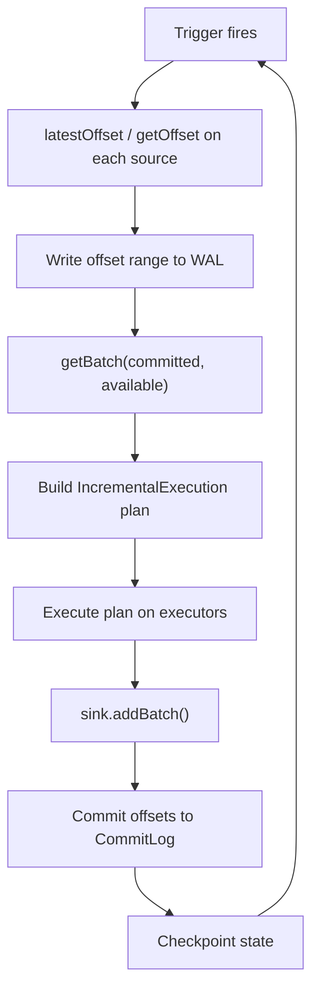
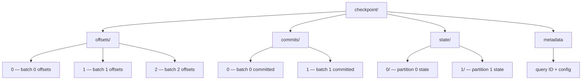

# Spark Structured Streaming
## Incremental Processing on a Batch Engine

*Treating streams as unbounded tables*

**Data Engineering, Lecture 4**

<!-- Speaker: Welcome students. Today we look at how Spark unifies batch and streaming under a single declarative API — the core idea behind Structured Streaming. -->

<!-- Notes:
This lecture covers Spark Structured Streaming, the stream processing component of Apache Spark
introduced in Spark 2.0 and described in a SIGMOD 2018 paper by Armbrust et al. The key innovation
is treating streams as unbounded tables and automatically incrementalizing static relational queries.
We will trace a clickstream pipeline example through the entire system, from the programming model
through execution, checkpointing, watermarks, state management, and operational pitfalls.
The lecture assumes students are familiar with Spark SQL, DataFrames, and basic distributed systems concepts.
-->

---

## Agenda

1. The Infinite Table Model
2. Micro-Batch Execution Engine
3. Exactly-Once Guarantees and Checkpointing
4. Running Example: Clickstream Pipeline
5. Watermarks and Late Data Handling
6. Stateful Operations and State Stores
7. Micro-Batch vs. Continuous Processing vs. Flink
8. Operational Failure Modes and Production Concerns
9. Summary and Key Takeaways

<!-- Speaker: Here is the roadmap. We start with the conceptual model, move into execution mechanics, then tackle the hard parts — watermarks, state, and production operations. -->

<!-- Notes:
The lecture is structured to build from concepts to internals to practice. Sections A-C cover the
programming model and execution guarantees. Section D introduces a running example that threads
through the rest of the lecture. Sections E-F cover the harder topics of watermarks and state.
Section G compares execution modes and competing systems. Section H addresses real-world operational
concerns that students will encounter in production. Budget roughly 5-7 minutes per section.
-->

---

<!-- _class: lead -->

# Section A: The Infinite Table Model

---

## Why Unify Batch and Streaming?

- Traditional stream processors (DStreams, Storm) require users to build a **DAG of physical operators** manually
- Structured Streaming takes a **declarative approach**: users write a static relational query, and the engine automatically incrementalizes it [claim:sss:declarative_incrementalization:004]
- This eliminates the need for developers to reason about windowing, retries, and state management at the operator level

<!-- Speaker: Contrast the old DStream model where you wire up transformations by hand with Structured Streaming's declarative approach — the SIGMOD 2018 paper's core thesis. -->

<!-- Notes:
Before Structured Streaming, Spark offered DStreams (Discretized Streams), which exposed an RDD-level
API where users manually composed a DAG of operators. Apache Storm similarly required wiring spouts
and bolts. Both approaches forced developers to think about physical execution — how data flows,
how state is managed, how failures are retried. The SIGMOD 2018 paper by Armbrust et al. argued
that a relational API (SQL or DataFrames) can automatically incrementalize static queries, freeing
developers from these concerns. This is the same idea as incremental view maintenance in databases,
applied to streaming. Students should understand that "declarative" means specifying *what* to compute,
not *how* to compute it incrementally.
-->

---

## Stream as an Unbounded Table

- A live data stream is treated as a **table that is being continuously appended** — every arriving data item is a new row in an unbounded Input Table [claim:sss:unbounded_table:001]
- Users express streaming computations as **standard batch-like queries** on this table, and Spark runs them as incremental queries on the unbounded input [claim:sss:batch_like_query:002]

<!-- Speaker: Draw the mental picture — every arriving record is a new row appended to an ever-growing Input Table. The user writes the same query they would write on a static table, and Spark runs it incrementally. -->

<!-- Notes:
This is the central abstraction of Structured Streaming. Instead of thinking about "events arriving
on a stream," students should think about "rows being appended to an infinite table." The query the
user writes is identical to what they would write on a bounded table — a SELECT with GROUP BY, for
example. The engine's job is to figure out how to run that query incrementally as new rows arrive.
This mental model is powerful because it lets developers reuse their SQL and DataFrame knowledge.
A common student question is "where is this table stored?" — the answer is that it is not materialized;
it is a logical abstraction that the engine processes incrementally.
-->

---

## Same API, Batch and Streaming

- A query on a streaming DataFrame uses **the same DataFrame/Dataset API** as a static DataFrame, enabling code reuse across batch and streaming workloads [claim:sss:same_api:003]
- Structured Streaming **reuses Spark SQL's Catalyst optimizer and Tungsten code generation**, so optimizations like predicate pushdown, projection pushdown, and expression simplification apply automatically [claim:sss:catalyst_reuse:005]

```python
# Batch query
df = spark.read.parquet("clicks/")
counts = df.groupBy("url").count()

# Streaming query — same transformation logic
sdf = spark.readStream.format("kafka").load()
counts = sdf.groupBy("url").count()
counts.writeStream.format("console").start()
```

<!-- Speaker: Emphasize that the DataFrame query is identical for batch and streaming. Catalyst and Tungsten optimizations apply automatically — zero extra work for the developer. -->

<!-- Notes:
The code example shows the key benefit: the transformation logic (groupBy + count) is identical
between batch and streaming. Only the I/O layer changes — read vs. readStream, write vs. writeStream.
Under the hood, Catalyst applies the same optimization rules it would apply to a batch query:
predicate pushdown (push filters to the source), projection pushdown (read only needed columns),
and expression simplification. Tungsten's code generation compiles operator chains into efficient
Java bytecode. Students sometimes ask whether streaming queries are slower than batch — they are
not inherently slower; the per-batch overhead is the scheduling cost, not the query optimization cost.
-->

---

## Incremental, Not Materialized

- The engine does **not** keep the entire unbounded table in memory — it reads the latest available data, processes it incrementally, keeps only minimal intermediate state, and discards the source data [claim:sss:incremental_state:006]
- Each micro-batch is executed via **IncrementalExecution**, a variant of QueryExecution that injects streaming-specific planner strategies (StatefulAggregationStrategy, StreamingJoinStrategy) and manages stateful checkpointing across batches [claim:sss:incremental_execution:012]

<!-- Speaker: Clarify the key misconception — the engine does NOT keep the entire unbounded table in memory. It processes incrementally and keeps only the state it needs. -->

<!-- Notes:
This is the most common misconception students have about the "infinite table" model. They hear
"unbounded table" and assume the system stores all data forever. In reality, the engine reads a
small batch of new data, updates running aggregates or state, emits results, and discards the raw
input. Only the minimal intermediate state (e.g., running counts per window) is retained.
IncrementalExecution is the internal mechanism that makes this work — it extends Spark SQL's normal
QueryExecution with streaming-specific planner strategies. StatefulAggregationStrategy handles
windowed aggregations by maintaining state between batches. StreamingJoinStrategy handles
stream-stream joins. Students should understand that "incremental" means processing only the
delta (new data) each batch, not re-processing everything from scratch.
-->

---

<!-- _class: lead -->

# Section B: Micro-Batch Execution

---

## Trigger Modes Overview

Structured Streaming supports **four trigger modes** [claim:sss:trigger_types:007]:

| Trigger | Behavior | Semantics |
|---|---|---|
| `ProcessingTime(interval)` | Fixed-interval micro-batches; interval=0 means as-fast-as-possible | Exactly-once |
| `Once` *(deprecated 3.4)* | Single batch, then stop | Exactly-once |
| `AvailableNow` | All available data in multiple batches, then stop (replaces Once) | Exactly-once |
| `Continuous(checkpoint_interval)` | Experimental low-latency (~1 ms) | At-least-once |

```python
query = (sdf.writeStream
    .trigger(processingTime="30 seconds")  # our clickstream example
    .start())
```

<!-- Speaker: Walk through all four trigger modes. Our running example uses ProcessingTime("30 seconds"). Note that Once is deprecated in favor of AvailableNow since Spark 3.4. -->

<!-- Notes:
ProcessingTime is the most common trigger mode in production. With an interval of "30 seconds,"
the engine waits 30 seconds between starting each micro-batch. If processing takes longer than
30 seconds, the next batch starts immediately after the previous one finishes. Setting interval
to 0 means "run as fast as possible" — start the next batch immediately after the current one commits.
Once was used for "streaming-style batch" use cases (e.g., nightly ingestion) but was deprecated
because it tried to process all data in a single batch, which could fail on large backlogs.
AvailableNow replaces it by splitting available data into multiple batches for better scalability.
Continuous mode is fundamentally different — it launches long-running tasks instead of recurring
short jobs. We will cover it in detail in Section G. For now, note the key tradeoff: Continuous
achieves ~1 ms latency but only provides at-least-once guarantees.
-->

---

## The Micro-Batch Execution Loop



- Each micro-batch has two phases: **constructNextBatch** (discover offsets, write WAL) and **runBatch** (retrieve data, build IncrementalExecution plan, write through sink) [claim:sss:microbatch_loop:008]
- The driver tracks **committedOffsets** (already processed) and **availableOffsets** (latest discovered from sources); each batch processes the range between them [claim:sss:offset_tracking:009]

<!-- Speaker: Trace one full iteration step by step through the diagram. Emphasize the two-phase structure: plan the batch, then execute it. -->

<!-- Notes:
This diagram shows the heartbeat of Structured Streaming. Every trigger interval, the engine:
(1) Queries each source for its latest offset (e.g., Kafka high-water mark).
(2) Writes the offset range [committedOffsets, availableOffsets] to the write-ahead log before doing any work.
(3) Calls getBatch to retrieve the actual data for that offset range.
(4) Builds an IncrementalExecution plan — the same Catalyst-optimized plan as a batch query, but
with streaming-specific operators for state management.
(5) Executes the plan across executors.
(6) Calls sink.addBatch() to write results.
(7) Commits offsets to the CommitLog, marking the batch as complete.
(8) Checkpoints state asynchronously.
The two-phase structure (WAL write before execution, CommitLog write after) is what enables
exactly-once semantics on recovery. Students should be able to trace a single micro-batch
through this loop and explain what happens at each step.
-->

---

## Offset Tracking Protocol

- The driver calls **latestOffset() / getOffset()** on each source to discover new data, then **getBatch(start, end)** to retrieve the data range [claim:sss:offset_tracking:009]
- Offsets are persisted in the **OffsetSeqLog** — versioned files in HDFS-compatible storage, one per batch ID [claim:sss:offset_seq_log:011]
- On restart, **populateStartOffsets** reads the latest committed batch ID from this log to determine where to resume processing [claim:sss:offset_seq_log:011]

```
checkpoint/offsets/
├── 0    # {"kafka_topic": {"0": 0, "1": 0}}
├── 1    # {"kafka_topic": {"0": 150, "1": 142}}
├── 2    # {"kafka_topic": {"0": 310, "1": 298}}
└── ...
```

<!-- Speaker: Detail the committedOffsets vs. availableOffsets distinction. The OffsetSeqLog is one file per batch in HDFS — on restart, the engine reads the latest to find its resume point. -->

<!-- Notes:
The offset tracking protocol is the foundation of Structured Streaming's fault tolerance.
committedOffsets represents the end of the last successfully completed batch — everything up to
this point has been processed and committed to the sink. availableOffsets represents the latest
data available from sources — the next batch will process data between these two boundaries.
The OffsetSeqLog stores these as versioned files (one per batch) in HDFS-compatible storage.
Before execution, the available offsets are written to this log. This is the "write-ahead" in WAL.
On restart, populateStartOffsets reads the latest entry to determine where processing left off.
Students should understand that this is similar to a database transaction log — it enables
replay of incomplete transactions. The key insight is that offsets are logged *before* execution
begins, so the system always knows what data range a failed batch was supposed to process.
-->

---

## Micro-Batch Latency

- The default micro-batch engine achieves **end-to-end latencies as low as ~100 milliseconds** with exactly-once guarantees [claim:sss:microbatch_latency:013]
- This latency floor comes from **task scheduling and launch overhead** between batches — even with interval=0, there is irreducible overhead per batch
- For many use cases (dashboards, alerting, ETL), 100 ms is more than sufficient

<!-- Speaker: Set expectations — 100 ms is the practical latency floor for micro-batch due to scheduling overhead. This is good enough for most streaming use cases but not for ultra-low-latency needs. -->

<!-- Notes:
The ~100 ms latency floor is a fundamental characteristic of the micro-batch architecture.
Between batches, the driver must: discover new offsets, write to the WAL, plan the query,
schedule tasks on executors, collect results, and commit. Each of these steps adds latency.
Even with ProcessingTime(0) (as fast as possible), this overhead remains. For comparison,
Apache Flink processes events individually with sub-millisecond latency. However, 100 ms is
perfectly adequate for the vast majority of streaming use cases — real-time dashboards,
alerting systems, ETL pipelines, and even many fraud detection systems operate on second-level
latency requirements. Students should not view 100 ms as a limitation but rather as a design
tradeoff: micro-batch gives you exactly-once semantics, full SQL support, and integration
with the Spark ecosystem at the cost of slightly higher latency than per-event systems.
-->

---

<!-- _class: lead -->

# Section C: Exactly-Once Guarantees and Checkpointing

---

## WAL-Based Exactly-Once Protocol

- Exactly-once is guaranteed by **two persistent logs** in the checkpoint directory [claim:sss:wal_exactly_once:010]:
  - **OffsetSeqLog**: records the offset range for each batch **before** execution begins
  - **CommitLog**: records successful completion **after** sink output
- On recovery, the engine **replays any batch** whose offsets were logged but not yet committed [claim:sss:wal_exactly_once:010]
- Combined with **replayable sources** (Kafka, Kinesis) and **idempotent sinks** (Delta, Iceberg), this yields end-to-end exactly-once [claim:sss:wal_exactly_once:010]

<!-- Speaker: Walk through the two-log protocol. OffsetSeqLog is the "intent" log, CommitLog is the "done" log. On failure, compare the two to find the uncommitted batch and replay it. -->

<!-- Notes:
The exactly-once guarantee relies on three components working together:
(1) The two-log protocol: OffsetSeqLog records intent (what data to process), CommitLog records
completion (processing succeeded). If the engine crashes between these two writes, recovery
finds the "gap" — a batch with an offset entry but no commit entry — and replays it.
(2) Replayable sources: Kafka and Kinesis support reading from specific offsets, so the engine
can re-read the exact same data range on recovery. File sources are also replayable by definition.
(3) Idempotent sinks: Writing the same batch twice must produce the same result. Delta Lake and
Iceberg achieve this through transaction IDs — if a batch with the same ID is written again,
the duplicate is detected and ignored.
Students often ask "what if the sink is not idempotent?" — in that case, you get at-least-once
semantics (data may be duplicated), not exactly-once. The guarantee is only as strong as the
weakest link in the chain.
-->

---

## Checkpoint Directory Layout



- **offsets/**: one file per batch, written **at batch start** (the intent log) [claim:sss:checkpoint_layout:029]
- **commits/**: one file per batch, written **at batch end** (the completion log) [claim:sss:checkpoint_layout:029]
- **state/**: partitioned state-store snapshots for stateful operators [claim:sss:checkpoint_layout:029]
- **metadata**: query ID and configuration [claim:sss:checkpoint_layout:029]

<!-- Speaker: Show the directory tree. On recovery, the engine compares offsets vs. commits to find incomplete batches. In this diagram, batch 2 has an offset entry but no commit — it will be replayed. -->

<!-- Notes:
The checkpoint directory is the durable foundation of fault tolerance. Students should understand
the role of each subdirectory:
- offsets/ acts as the write-ahead log (WAL). Before any data processing begins for a batch,
  the source offsets are written here. This ensures the system knows exactly what data range
  each batch covers, even after a crash.
- commits/ acts as the completion log. After sink.addBatch() succeeds, a commit file is written.
  The gap between offsets/ and commits/ reveals incomplete batches on recovery.
- state/ holds versioned snapshots of stateful operator state (e.g., aggregation counts).
  These are written asynchronously and may lag behind the latest committed batch. On recovery,
  the engine loads the most recent snapshot and replays intermediate batches to catch up.
- metadata stores the query's unique ID and serialized configuration, ensuring that a restarted
  query reconnects to its previous state.
In the diagram, offsets has entries 0, 1, 2 but commits only has 0, 1 — batch 2 will be replayed.
-->

---

## Recovery Semantics

- On recovery, the engine reads the WAL to find the **last uncommitted epoch** [claim:sss:state_checkpoint_recovery:030]
- It loads the **most recent state-store snapshot** and replays intermediate epochs to reconstruct in-memory state [claim:sss:state_checkpoint_recovery:030]
- The failed epoch is rerun with output relying on **sink idempotence** to avoid duplicates [claim:sss:state_checkpoint_recovery:030]
- State checkpointing is **asynchronous** and does not need to happen every epoch [claim:sss:state_checkpoint_recovery:030]

```
Recovery timeline:
  State snapshot @ batch 5 → Replay batches 6,7 (output disabled) → Rerun batch 8 → Resume
```

<!-- Speaker: Walk through recovery step by step: find the gap, load state snapshot, replay to catch up, rerun the failed batch, resume normal processing. -->

<!-- Notes:
Recovery is a multi-step process that students should be able to trace:
1. Read the WAL to identify the last batch with an offset entry but no commit entry (the failed batch).
2. Load the most recent state-store snapshot. Since state checkpointing is asynchronous, this
   snapshot may be several batches behind the failed batch.
3. Replay all batches between the snapshot and the failed batch with output disabled. This
   reconstructs the in-memory state without producing duplicate output. The engine can replay
   because it knows the exact offset ranges from the WAL.
4. Rerun the failed batch. The sink's idempotence ensures that if partial output was written
   before the crash, the duplicate write is harmlessly ignored.
5. Resume normal processing with the next batch.
The key insight about async state checkpointing is that it reduces steady-state overhead —
the engine does not need to write a full state snapshot every batch. The cost is longer
recovery time, since more batches may need to be replayed to reconstruct state.
-->

---

<!-- _class: lead -->

# Section D: Running Example — Clickstream Pipeline

---

## Running Example Introduction

- **Scenario**: real-time clickstream from a web application
  - Kafka topic with `user_id`, `url`, `event_time` fields
  - Goal: 10-minute tumbling-window page-view counts per URL
  - 5-minute watermark for late data tolerance
  - Output to an Iceberg table
- Every arriving click event is a **new row appended to the unbounded Input Table** [claim:sss:unbounded_table:001]
- This example threads through the rest of the lecture

<!-- Speaker: Introduce the clickstream scenario. This is the example we will trace through watermarks, state management, and operational concerns. -->

<!-- Notes:
The clickstream pipeline is a realistic use case that touches every concept in this lecture.
A web application produces click events to a Kafka topic. Each event has a user_id (who clicked),
a url (what page), and an event_time (when, in event time, not processing time). Our goal is to
count page views per URL in 10-minute tumbling windows — a common analytics query. The 5-minute
watermark means we tolerate events arriving up to 5 minutes late. We write results to an Iceberg
table, which gives us exactly-once via idempotent writes. Students should keep this example in
mind throughout the lecture — when we discuss watermarks, we will trace specific late events
through this pipeline; when we discuss state stores, the window counts are the state; when we
discuss small files, each micro-batch writes to Iceberg.
-->

---

## Complete Clickstream Query

```python
from pyspark.sql import SparkSession
from pyspark.sql.functions import from_json, col, window
from pyspark.sql.types import StructType, StringType, TimestampType

spark = SparkSession.builder.appName("Clickstream").getOrCreate()

schema = StructType() \
    .add("user_id", StringType()) \
    .add("url", StringType()) \
    .add("event_time", TimestampType())

# Read from Kafka — same as batch read, but readStream
clicks = (spark.readStream
    .format("kafka")
    .option("kafka.bootstrap.servers", "broker:9092")
    .option("subscribe", "clickstream")
    .load()
    .select(from_json(col("value").cast("string"), schema).alias("data"))
    .select("data.*"))

# Watermark + windowed aggregation — same as batch groupBy
page_counts = (clicks
    .withWatermark("event_time", "5 minutes")       # [claim:sss:withwatermark_api:024]
    .groupBy(window("event_time", "10 minutes"), "url")
    .count())

# Write to Iceberg with checkpointing
query = (page_counts.writeStream
    .format("iceberg")
    .outputMode("append")
    .trigger(processingTime="30 seconds")
    .option("checkpointLocation", "/checkpoints/clickstream")
    .toTable("catalog.db.page_counts"))
```

- The query uses the **same DataFrame API** as a batch groupBy [claim:sss:same_api:003] — streaming computation expressed as a **standard batch-like query** [claim:sss:batch_like_query:002]
- **withWatermark()** must be on the same column as the aggregation and must precede the groupBy [claim:sss:withwatermark_api:024]

<!-- Speaker: Walk through every line — readStream from Kafka, parse JSON, withWatermark, groupBy window + URL, count, writeStream to Iceberg. Point out this is the same code as a batch groupBy, plus watermark and writeStream. -->

<!-- Notes:
This is the complete, runnable clickstream query. Walk through it line by line:
1. Schema definition: user_id, url, event_time — matches the Kafka message format.
2. readStream from Kafka: reads the "clickstream" topic. The .load() returns a DataFrame with
   key, value, topic, partition, offset, timestamp columns. We parse the value as JSON.
3. withWatermark("event_time", "5 minutes"): tells the engine to track the maximum event_time
   seen and allow events up to 5 minutes late. This must appear before the groupBy.
4. groupBy(window("event_time", "10 minutes"), "url").count(): standard Spark SQL windowed
   aggregation. The window function creates 10-minute tumbling windows on event_time.
5. writeStream to Iceberg in append mode with a 30-second trigger and a checkpoint location.
The critical point is that the transformation logic (lines 3-4) is identical to what you would
write for a batch query on a static Parquet table. Only the I/O (readStream/writeStream) differs.
Common student mistake: placing withWatermark after the groupBy — this is invalid and will be
silently ignored, leading to unbounded state growth.
-->

---

## What Happens Under the Hood

- Each trigger fires the **micro-batch execution loop**: Kafka offsets are discovered, data is retrieved for the range [committed, available] [claim:sss:microbatch_loop:008]
- **IncrementalExecution** builds the plan with streaming-specific strategies — StatefulAggregationStrategy manages the running window counts in the state store [claim:sss:incremental_execution:012]
- Results flow through the sink to the Iceberg table; offsets are committed; state is checkpointed

```
Trigger fires (every 30s)
  → Kafka offsets: partition 0 @ 1500, partition 1 @ 1420
  → getBatch: read events [1350..1500], [1280..1420]
  → IncrementalExecution: update window counts in state store
  → sink.addBatch(): write new/updated counts to Iceberg
  → commit offsets, checkpoint state
```

<!-- Speaker: Trace one micro-batch of the clickstream query through the execution loop — offsets discovered, plan built, window counts updated in state, results written to Iceberg. -->

<!-- Notes:
This slide connects the abstract execution loop from Section B to our concrete example.
In each micro-batch:
1. The engine queries Kafka for the latest offsets across all partitions of the "clickstream" topic.
2. It retrieves all events between the last committed offsets and the new latest offsets.
3. IncrementalExecution builds a plan that includes StatefulAggregationStrategy — this operator
   reads the current window counts from the state store, adds the new events' contributions,
   and writes updated counts back to the state store.
4. In append mode with a watermark, the engine checks which windows have closed (watermark has
   passed their end time) and emits those final counts to the Iceberg sink via addBatch().
5. The committed offsets advance, and state is checkpointed asynchronously.
Students should understand that the state store holds the running counts for all open windows.
For our 10-minute windows with a 5-minute watermark, at any given time the state holds roughly
15 minutes' worth of windows (current + one past window that hasn't been emitted yet).
-->

---

<!-- _class: lead -->

# Section E: Watermarks and Late Data

---

## The Late Data Problem — Unbounded State

- Without watermarks, **every window since the application began** must be kept in state because a late record could arrive for any window [claim:sss:watermark_state_bound:020]
- For our clickstream query: 10-minute windows x thousands of URLs = **state grows without bound**
- After running for a week: 1,008 windows per URL, multiplied by every URL ever seen

<!-- Speaker: Without watermarks, the engine must keep a counter for every 10-minute window since startup for every URL. State grows linearly with time, eventually causing OOM. -->

<!-- Notes:
This slide motivates why watermarks are necessary, not optional, for production streaming.
Without a watermark, the engine has no way to know when a window is "done" — a click event
with event_time from three days ago could theoretically arrive at any moment. So the engine
must keep every window open indefinitely. For our clickstream query with 10-minute windows,
that is 144 windows per day per URL. After a week, that is 1,008 windows per URL. If there
are 10,000 distinct URLs, that is over 10 million state entries. Combined with JVM overhead
per entry, this quickly exhausts executor memory. The problem is even worse with fine-grained
windows (1-minute) or high-cardinality keys (user_id instead of url). Watermarks solve this
by defining a point in event time after which data is considered "too late" and windows can
be safely closed and their state dropped. This is a fundamental tradeoff: completeness vs.
bounded resource usage.
-->

---

## Watermark Definition

- Watermark = **max(event_time) - delay_threshold** [claim:sss:watermark_definition:019]
- For our clickstream: if max event_time seen = 12:30, watermark = 12:30 - 5 min = **12:25**
- **Naturally robust to backlog**: if the system falls behind, max(event_time) stops advancing, so the watermark doesn't jump forward and drop valid data [claim:sss:watermark_definition:019]

```
max(event_time):     12:10  12:15  12:20  12:25  12:30
                       |      |      |      |      |
watermark:           12:05  12:10  12:15  12:20  12:25
                       ↑                           ↑
                   5 min behind               5 min behind
```

<!-- Speaker: Define watermark = max(event_time) - threshold. Emphasize the natural backlog robustness — if the system can't keep up, the watermark won't advance arbitrarily. -->

<!-- Notes:
The watermark formula is simple but its implications are subtle. max(event_time) is tracked
globally across all partitions — it is the maximum event time the engine has seen in any record
so far. The delay threshold (5 minutes in our example) is the user's tolerance for late data.
The watermark always lags behind the latest data by exactly this threshold.
The "natural backlog robustness" property is important and often overlooked. In systems like
Google Cloud Dataflow, watermarks can be based on wall-clock time, which means if the system
falls behind, the watermark advances even though the system hasn't processed the data yet —
potentially dropping valid events. In Structured Streaming, the watermark is based on the
data itself (max event_time seen), so if the system is backlogged and hasn't processed recent
data, max(event_time) stays at the last processed time, and the watermark stays put. No valid
data is dropped during a backlog. This is a deliberate design choice from the SIGMOD 2018 paper
(Section 4.3.1).
-->

---

## withWatermark() API and Placement Rules

```python
# CORRECT: withWatermark before groupBy, on the same column
clicks \
    .withWatermark("event_time", "5 minutes") \
    .groupBy(window("event_time", "10 minutes"), "url") \
    .count()

# INCORRECT: withWatermark after groupBy — silently becomes a no-op
clicks \
    .groupBy(window("event_time", "10 minutes"), "url") \
    .count() \
    .withWatermark("event_time", "5 minutes")  # ← WRONG: too late

# INCORRECT: withWatermark on a different column than the aggregation
clicks \
    .withWatermark("processing_time", "5 minutes") \
    .groupBy(window("event_time", "10 minutes"), "url") \
    .count()  # ← WRONG: different column
```

- **withWatermark()** must be on the **same column** as the aggregation and must **precede** the groupBy in the query plan [claim:sss:withwatermark_api:024]
- Calling it on a **non-streaming Dataset** is silently a no-op [claim:sss:withwatermark_api:024]

<!-- Speaker: Show correct and incorrect placement. The most common mistake is placing withWatermark after the groupBy — it silently does nothing, and state grows without bound. -->

<!-- Notes:
The withWatermark API has two strict placement rules that students must memorize:
1. Same column: The column passed to withWatermark must be the same column used in the
   time-based aggregation (e.g., the column passed to the window() function). Using a
   different column means the watermark tracks one timeline while the aggregation operates
   on another — the engine cannot use the watermark to prune state.
2. Before aggregation: withWatermark must appear before groupBy in the logical query plan.
   If placed after, the optimizer cannot use it to inform the aggregation strategy.
The dangerous aspect is that both incorrect patterns compile and run without error. The query
will produce correct results — but state will grow without bound because the watermark is
effectively disabled. This is a common production issue: a streaming job runs fine for hours
or days, then suddenly OOMs because state was never being cleaned up. Students should always
verify watermark placement in code reviews. Also note that calling withWatermark on a batch
DataFrame (e.g., during testing) is silently ignored, which is by design — it lets you reuse
the same query for both batch and streaming without conditional logic.
-->

---

## How Watermarks Clean Up State

- In **Append mode**: the engine holds partial aggregation results, waits for the watermark to pass the window's end time, then **emits the final result and drops the window's state** [claim:sss:watermark_state_cleanup:021]
- The guarantee is **one-sided**: data within the threshold is **never dropped**; data beyond the threshold **may or may not** be processed — more-delayed data is less likely to be included [claim:sss:watermark_guarantee:022]

| Data lateness | Guarantee |
|---|---|
| Within delay threshold | **Always** included in the result |
| Beyond delay threshold | **May or may not** be included (best-effort) |

<!-- Speaker: The watermark guarantee is one-sided — within the threshold is guaranteed, beyond is best-effort. In Append mode, state cleanup happens when the watermark passes the window end. -->

<!-- Notes:
The one-sided guarantee is a subtle but critical point. Students often assume the watermark
is a hard cutoff — events arriving more than 5 minutes late are always dropped. This is wrong.
The guarantee says: events within 5 minutes of the latest data are guaranteed to be processed.
Events more than 5 minutes late *might* still be processed if they arrive before the state for
their window has been cleaned up. Whether they are processed depends on timing — specifically,
whether the window's state has already been emitted and dropped when the late event arrives.
In practice, events that are slightly beyond the threshold often do get processed because
state cleanup happens asynchronously. But this is not guaranteed and should not be relied upon.
In Append mode specifically, the engine holds window state until the watermark passes the
window's end time (window_end < watermark), then emits the final count and drops the state.
After that point, any events for that window are definitively dropped because the state no
longer exists.
-->

---

## Watermarks and Output Modes

| | **Append** | **Update** | **Complete** |
|---|---|---|---|
| **When results emitted** | Once, after watermark passes window end | Every trigger (partial results) | Every trigger (full result table) |
| **State cleanup** | Yes — after emit | Yes — watermark prunes old state | No — all state retained |
| **Duplicate output rows** | No — each row emitted once | Yes — updated rows re-emitted | Yes — entire table each trigger |
| **Use case** | Sinks that need final results (Iceberg, Kafka) | Dashboards, key-value stores | Small result sets, debugging |

- Watermarks interact differently with each output mode [claim:sss:watermark_output_modes:023]
- For the clickstream example writing to Iceberg: **Append is the right choice** (final counts, state cleanup, no duplicates)

<!-- Speaker: Three-column comparison. Append emits once after the watermark passes, Update emits partial results each trigger, Complete keeps everything. For Iceberg, Append is ideal. -->

<!-- Notes:
The interaction between watermarks and output modes is a common source of confusion.
Append mode: Results are emitted only once, after the watermark passes the window's end time.
This means there is a delay between when data is processed and when results appear in the sink
(at least equal to the watermark threshold). The benefit is that each row appears exactly once
in the output, and state is cleaned up after emission. This is ideal for append-only sinks
like Iceberg, Kafka topics, or file systems.
Update mode: Partial results are emitted every trigger. If a window count goes from 5 to 8,
the updated row (count=8) is re-emitted. The watermark is still used to prune old state, but
the benefit is lower latency — you see results before the window closes. This is good for
key-value stores or dashboards that can handle updates.
Complete mode: The entire result table is emitted every trigger. No state is ever cleaned up
because the full history must be preserved. This is only practical for small result sets (e.g.,
a few hundred keys) and is mainly useful for debugging or interactive exploration.
For our clickstream example, Append mode is correct because Iceberg is an append-only sink
and we want final, deduplicated counts.
-->

---

## Late Data Scenario Walkthrough

```
Timeline (clickstream example, watermark delay = 5 minutes):

Batch at processing time T:
  max(event_time) seen so far = 12:30
  watermark = 12:30 - 5 min = 12:25

  Record A: event_time = 12:22  →  12:22 ≥ 12:25? NO
    But 12:22 is in window [12:20, 12:30) which ends at 12:30
    Window end 12:30 > watermark 12:25  →  window still OPEN
    ✓ Record A IS counted in window [12:20, 12:30)

  Record B: event_time = 12:18  →  12:18 ≥ 12:25? NO
    12:18 is in window [12:10, 12:20) which ends at 12:20
    Window end 12:20 < watermark 12:25  →  window MAY BE CLOSED
    ? Record B may or may not be counted (not guaranteed)

  Window [12:10, 12:20):  end 12:20 < watermark 12:25
    → In Append mode: emit final count and DROP state
```

- Data **within** the watermark threshold: always processed [claim:sss:watermark_guarantee:022]
- Data **beyond** the threshold: best-effort, not guaranteed [claim:sss:watermark_guarantee:022]
- Once watermark passes a window's end, the **state is dropped** in Append mode [claim:sss:watermark_state_cleanup:021]

<!-- Speaker: Walk through this concrete timeline. Record A is within the watermark — guaranteed to be counted. Record B is beyond it — may or may not be counted. The 12:10-12:20 window can now be emitted and its state dropped. -->

<!-- Notes:
This walkthrough makes the watermark semantics concrete. Let students trace through it:
- max(event_time) = 12:30 means the latest click we have seen so far has event_time 12:30.
- watermark = 12:30 - 5 minutes = 12:25. This is the cutoff.
- Record A has event_time 12:22. Its window is [12:20, 12:30). The window end (12:30) is
  above the watermark (12:25), so the window is still open. Record A is counted.
- Record B has event_time 12:18. Its window is [12:10, 12:20). The window end (12:20) is
  below the watermark (12:25), so the window may have already been emitted and its state
  dropped. If the state still exists (e.g., state cleanup hasn't run yet), Record B is counted.
  If the state has been dropped, Record B is silently ignored.
- The window [12:10, 12:20) has end time 12:20 < watermark 12:25, so in Append mode, its
  final count is emitted to Iceberg and its state is dropped from the state store.
Students should understand that the 5-minute watermark does not mean "events arriving 5 minutes
late in wall-clock time" — it means "events whose event_time is more than 5 minutes behind
the maximum event_time seen so far." These are different if there is clock skew or backlog.
-->

---

<!-- _class: lead -->

# Section F: Stateful Operations and State Stores

---

## Built-In Stateful Operations

- **Windowed aggregations**: groupBy + window + agg — state holds partial aggregation results per window per key
- **Stream-stream joins**: buffer both sides as state so every future input can be matched with past input [claim:sss:stream_joins:026]
  - Inner joins: watermarks are **optional** (used to bound state)
  - Outer joins: watermarks + event-time constraints are **mandatory** (to know when to emit NULLs)
- **Arbitrary stateful processing**: mapGroupsWithState / flatMapGroupsWithState for custom logic like sessionization [claim:sss:stateful_ops:025]
  - `mapGroupsWithState`: returns **one record per key** per trigger
  - `flatMapGroupsWithState`: returns **zero or more records** per key — suitable for sessions, custom windows

<!-- Speaker: Three families of stateful operations. Stream-stream joins are the trickiest — they buffer both sides. For outer joins, watermarks are required to know when an unmatched row will never find a match. -->

<!-- Notes:
Structured Streaming provides three levels of stateful processing:
1. Windowed aggregations are the most common — our clickstream example uses them. State holds
   running counts (or sums, averages, etc.) per window per key. Watermarks control when
   windows are closed and state is dropped.
2. Stream-stream joins are conceptually challenging. When joining two streams, a record from
   stream A might match a record from stream B that hasn't arrived yet. So the engine must
   buffer past records from both streams. For inner joins, watermarks are optional — without
   them, state grows unboundedly but results are correct. For outer joins (LEFT, RIGHT, FULL),
   watermarks are required because the engine needs to know when an unmatched record will
   never find a match — only then can it emit the NULL-padded result.
3. mapGroupsWithState and flatMapGroupsWithState provide an escape hatch for custom stateful
   logic. The user defines an update function that takes the current state and new data for
   a key, and produces output. flatMapGroupsWithState is more flexible (zero or more outputs)
   and supports timeout-based state expiration, making it suitable for sessionization — e.g.,
   grouping user clicks into sessions based on inactivity gaps.
-->

---

## State Store — HDFS-Backed vs. RocksDB

| | **HDFS-Backed (default)** | **RocksDB (since Spark 3.2)** |
|---|---|---|
| **Storage location** | JVM heap (HashMap) | Native memory + local disk |
| **Scaling limit** | Millions of keys then GC pauses | 100M+ keys per executor |
| **Checkpointing** | Full snapshot each version | Changelog — only deltas uploaded |
| **GC impact** | High — large JVM pauses | Minimal — off-heap storage |
| **Configuration** | Default, no setup needed | Requires explicit memory bounding |

- HDFS-backed state store: all state in JVM heap, backed by versioned HDFS files — simple but prone to **GC pauses with millions of keys** [claim:sss:hdfs_state_store:027]
- RocksDB state store: off-heap native memory + local disk, **changelog checkpointing** uploads only deltas [claim:sss:rocksdb_state_store:028]
- RocksDB memory must be explicitly bounded via `spark.sql.streaming.stateStore.rocksdb.boundedMemoryUsage` to prevent unbounded native memory growth [claim:sss:state_store_growth:033]

<!-- Speaker: Two-column comparison. HDFS store is simple but GC-heavy. RocksDB scales but needs explicit memory bounds. For production workloads with large state, RocksDB is the right choice. -->

<!-- Notes:
The state store is where all intermediate state lives between micro-batches. The choice of
state store provider has a major impact on operational behavior:
HDFS-Backed (default): Every state entry is a Java object in a HashMap on the JVM heap.
This is simple and works well for small state (thousands to low millions of keys). But as
state grows, the JVM must garbage-collect these objects, causing "stop-the-world" GC pauses
that can make micro-batch processing times spike unpredictably. Each checkpoint writes a
full snapshot of all state to HDFS, which is expensive for large state.
RocksDB: State is stored in a native RocksDB instance on local disk with in-memory caching.
Since the data is off-heap, JVM GC is not affected by state size. RocksDB can handle 100
million+ keys per executor. Changelog checkpointing is a major advantage — instead of writing
full snapshots, only the changes (puts and deletes) since the last checkpoint are uploaded.
This dramatically reduces checkpoint I/O for large state with small per-batch changes.
However, RocksDB can consume unbounded native memory if not configured — the boundedMemoryUsage
config is essential in production to cap RocksDB's block cache and write buffer memory.
Students should understand that the default is fine for development but RocksDB should be
used for any production workload with significant state.
-->

---

<!-- _class: lead -->

# Section G: Micro-Batch vs. Continuous vs. Flink

---

## Comparison Table — Micro-Batch vs. Continuous vs. Flink

| | **Spark Micro-Batch** | **Spark Continuous** | **Apache Flink** |
|---|---|---|---|
| **Processing model** | Recurring small batch jobs | Long-running pipelined tasks | Per-event pipelined operators |
| **Latency** | ~100 ms floor [claim:sss:microbatch_latency:013] | ~1 ms [claim:sss:continuous_mode_latency:014] | Sub-millisecond |
| **Fault-tolerance** | Exactly-once | At-least-once only [claim:sss:continuous_mode_latency:014] | Exactly-once (async checkpoints) |
| **Supported operations** | Full SQL, stateful ops, joins | Map-like only (select, filter, map) [claim:sss:continuous_ops_limited:015] | Full stateful, SQL, CEP |
| **Task failure handling** | Automatic retry per batch | No auto retry — query stops [claim:sss:continuous_long_running:016] | Automatic task restart |
| **Sources** | Kafka, files, JDBC, custom | Kafka, Rate only [claim:sss:continuous_ops_limited:015] | Kafka, files, JDBC, custom |
| **State access** | State store (remote) | N/A (stateless ops only) | Local state (RocksDB) [claim:sss:flink_per_event:018] |
| **Maturity** | Production-ready | Experimental (never graduated) | Production-ready |

<!-- Speaker: Three-column comparison. Micro-batch trades latency for full features and exactly-once. Continuous gives low latency but very limited functionality. Flink offers the best of both worlds for per-event processing. -->

<!-- Notes:
This comparison table is the centerpiece of Section G. Students should understand the tradeoffs:
Spark Micro-Batch is the workhorse: full SQL support, exactly-once guarantees, automatic
failure recovery, and integration with the entire Spark ecosystem. The cost is ~100 ms minimum
latency due to scheduling overhead between batches. For 95% of streaming use cases, this is
the right choice.
Spark Continuous was an attempt to compete with Flink on latency. It achieves ~1 ms by running
long-lived tasks that continuously process data without the scheduling overhead of micro-batches.
But the limitations are severe: no aggregations, no joins, no stateful operations — only
map-like transformations. No automatic task retries. Only Kafka and Rate sources. At-least-once
only (no exactly-once). It was experimental in Spark 2.3 and never graduated.
Apache Flink is purpose-built for per-event streaming. It processes events individually through
pipelined operators with local state access (RocksDB on each task manager). It achieves
sub-millisecond latency with exactly-once semantics via asynchronous barrier-based checkpointing.
It supports full stateful operations, SQL, and complex event processing. The tradeoff vs. Spark
is ecosystem: if your organization already uses Spark for batch processing, adding Structured
Streaming is much simpler than adding a separate Flink cluster.
-->

---

## Why Continuous Processing Never Graduated

- Three fundamental blockers prevented Continuous mode from leaving experimental status [claim:sss:continuous_never_graduated:017]:
  1. **Only map-like operations** — no aggregations, no joins, no stateful processing [claim:sss:continuous_ops_limited:015]
  2. **Would require two separate checkpointing systems** — one for micro-batch, one for continuous [claim:sss:continuous_never_graduated:017]
  3. **Significant engine reimplementation** needed to support full operator set [claim:sss:continuous_never_graduated:017]
- Long-running tasks with **no automatic retries** made it fragile in production [claim:sss:continuous_long_running:016]
- The mode remains experimental and is **not recommended for production use**

<!-- Speaker: Three blockers killed Continuous mode. Limited to map-like ops, would need a separate checkpointing system, and needed major engine rework. Plus no auto-retry makes it fragile. -->

<!-- Notes:
Continuous Processing was introduced with ambition but hit fundamental architectural barriers.
The micro-batch engine's entire design — query planning per batch, state management between
batches, checkpoint-based recovery — is built around the batch abstraction. Continuous mode
would have needed its own parallel implementation of all these features.
The most damning limitation is the lack of stateful operations. Without aggregations, joins,
or mapGroupsWithState, the mode can only do stateless transformations — essentially acting as
a very expensive Kafka-to-Kafka pipe. For that use case, Kafka Streams or Flink are better choices.
The lack of automatic task retries is an operational nightmare. In micro-batch mode, if an
executor fails, the current batch fails and is automatically retried. In continuous mode, a
failed task stops the entire query, requiring manual intervention or external monitoring to
restart it. In a 24/7 production environment, this is unacceptable.
The Spark community evaluated a Real-Time Mode SPIP (Spark Project Improvement Proposal) to
address these issues but concluded the effort was too large relative to the benefit, especially
given that micro-batch latency is sufficient for most use cases.
-->

---

<!-- _class: lead -->

# Section H: Operational Pitfalls

---

## The Small-File Problem

- Each micro-batch writes **separate output files** — with a 30-second trigger, that is 2,880 file batches per day [claim:sss:small_file_problem:031]
- The file sink's `_spark_metadata` log **grows unboundedly** and can eventually OOM the driver [claim:sss:small_file_problem:031]
- With Iceberg, each batch produces a **new snapshot** with its own small data files, causing rapid metadata growth [claim:sss:iceberg_streaming_maintenance:036]

**Mitigations:**
- Increase trigger interval (e.g., 30s to 5 min) to reduce file count
- Run **periodic compaction** (Iceberg `rewriteDataFiles` every 1-4 hours) [claim:sss:iceberg_streaming_maintenance:036]
- Expire old snapshots to control metadata size [claim:sss:iceberg_streaming_maintenance:036]
- Use Delta Lake's **auto-compaction** if available [claim:sss:small_file_problem:031]

<!-- Speaker: Each micro-batch writes separate files. With a 30-second trigger, that is thousands of tiny files per day. You must compact periodically — this is not optional for production. -->

<!-- Notes:
The small-file problem is the most common operational issue with Structured Streaming. It
affects every file-based sink — Parquet, ORC, Delta Lake, and Iceberg. The root cause is that
each micro-batch creates independent output files. With a 30-second trigger, a day produces
2,880 batches, each writing one or more files per partition. These small files degrade read
performance (too many files to open), waste storage (per-file overhead), and grow metadata.
For the native file sink, _spark_metadata is particularly dangerous — it is a log of all files
written, and the driver reads it entirely into memory on restart. After days or weeks of
running, this log can grow to gigabytes, causing driver OOM.
For Iceberg, each batch commit creates a new snapshot. Snapshots accumulate manifest files
and data file references. Without maintenance, metadata operations (like planning a scan)
become slow. The recommended practice is to run rewriteDataFiles every 1-4 hours to merge
small data files into larger ones, and expire old snapshots (e.g., keep only 24 hours) to
control metadata size. Delta Lake handles this better with built-in auto-compaction (OPTIMIZE),
but even Delta benefits from periodic maintenance.
The simplest mitigation is often the most effective: increase the trigger interval. Going from
30 seconds to 5 minutes reduces file count by 10x with only a modest increase in latency.
-->

---

## State Store Growth Under Skewed Keys

- Skewed keys cause **uneven state distribution** — one executor holds disproportionate state [claim:sss:state_store_growth:033]
- HDFS-backed store: large state on one executor causes **JVM GC pauses** and potential OOM [claim:sss:state_store_growth:033]
- RocksDB store: must set `boundedMemoryUsage = true` to prevent **unbounded native memory growth** [claim:sss:state_store_growth:033]

**Mitigations:**
- **Salt keys**: append a random suffix to distribute hot keys across partitions
- Switch to **RocksDB** with explicit memory bounds [claim:sss:rocksdb_state_store:028]
- Monitor state metrics via **StreamingQueryListener** (numRowsTotal, numRowsUpdated)
- Set watermarks to **aggressively prune old state**

```python
# Enable RocksDB state store with bounded memory
spark.conf.set("spark.sql.streaming.stateStore.providerClass",
    "org.apache.spark.sql.execution.streaming.state.RocksDBStateStoreProvider")
spark.conf.set("spark.sql.streaming.stateStore.rocksdb.boundedMemoryUsage", "true")
spark.conf.set("spark.sql.streaming.stateStore.rocksdb.maxMemoryUsageMB", "512")
```

<!-- Speaker: Skewed keys create hot executors with disproportionate state. The fix is RocksDB with bounded memory plus key salting for extreme skew. -->

<!-- Notes:
State skew is a subtle but severe problem. In our clickstream example, if one URL (say, the
homepage) gets 100x more traffic than others, the executor that handles that URL's partition
will hold 100x more state entries. With the HDFS-backed store, this means one executor has
a massive HashMap while others have small ones — the overloaded executor will experience
much longer GC pauses, causing the entire batch to slow down (the batch completes only when
the slowest task finishes).
With RocksDB, the state is off-heap, so GC is not the issue. But RocksDB can consume
unbounded memory for its block cache and write buffers unless explicitly bounded. Setting
boundedMemoryUsage to true enables a shared memory pool across all RocksDB instances on an
executor, capping total memory usage. The maxMemoryUsageMB should be set based on available
executor memory minus JVM heap.
Key salting is a technique where you append a random integer (e.g., 0-9) to the grouping key,
spreading a single hot key across 10 partitions. The downstream consumer must then sum across
all 10 salted keys. This is effective but adds query complexity.
StreamingQueryListener provides metrics like numRowsTotal (total state entries) and
numRowsUpdated (entries modified this batch) per stateful operator — essential for monitoring
state growth in production.
-->

---

## Checkpoint Compatibility — What You Can and Cannot Change

| **Safe Changes** (keep existing checkpoint) | **Breaking Changes** (require new checkpoint) |
|---|---|
| Add or remove filters | Change `spark.sql.shuffle.partitions` |
| Change rate limits | Change state store provider class |
| Modify trigger interval | Change watermark policy |
| Add/modify projections | Add/remove/modify stateful operations |
| | Change number or type of input sources |
| | Switch output sink type |

- `spark.sql.shuffle.partitions` is frozen because **state is hash-partitioned** — changing the partition count would orphan state [claim:sss:checkpoint_compatibility:032]
- Stateful operation changes (additions, deletions, schema modifications) are **not allowed** between restarts [claim:sss:checkpoint_compatibility:032]
- Safe changes include adding/removing filters and changing rate limits or trigger intervals [claim:sss:checkpoint_allowed_changes:035]

<!-- Speaker: This table is critical for production operations. Changing shuffle partitions or stateful operations requires a new checkpoint — plan these changes carefully. -->

<!-- Notes:
Checkpoint compatibility is a frequent source of production incidents. Students must understand
why certain changes are breaking:
- shuffle.partitions: State is stored in partitions determined by hash(key) % numPartitions.
  If you change numPartitions, each key maps to a different partition. The existing state
  files were written with the old partition mapping, so the engine would read the wrong state
  for each key — causing incorrect results or errors. This is the most common "gotcha."
- State store provider: HDFS-backed and RocksDB use completely different on-disk formats.
  Switching providers without a new checkpoint causes deserialization errors.
- Watermark policy: The multiple-watermark policy (min vs. max across operators) affects
  how the global watermark is computed. Changing it mid-stream could cause incorrect state
  cleanup.
- Stateful operations: Adding, removing, or modifying a stateful operator (e.g., adding a
  new aggregation, changing a window size) changes the state schema. Existing state is
  incompatible with the new schema.
Safe changes are those that affect only the stateless part of the query plan — filters,
projections, rate limits, and trigger intervals. These don't touch state or partitioning.
When a breaking change is needed, the standard approach is to create a new checkpoint directory,
potentially reprocess historical data to "warm up" state, and switch over. This requires
planning and may cause a gap in output.
-->

---

## Table-Format Sinks — Delta Lake and Iceberg

- **Delta Lake**: transaction log guarantees exactly-once even with concurrent writers; built-in auto-compaction via OPTIMIZE [claim:sss:delta_streaming_sink:034]
  - **Pitfall**: if checkpoint is deleted and query restarted without changing `appId`, writes are silently ignored due to txnAppId collision [claim:sss:delta_streaming_sink:034]

- **Iceberg**: requires explicit maintenance — tune commit rate, expire snapshots, compact data files, rewrite manifests [claim:sss:iceberg_streaming_maintenance:036]
  - Each micro-batch commit produces a new snapshot with its own small data files [claim:sss:iceberg_streaming_maintenance:036]

```python
# Iceberg maintenance (run periodically, e.g., every 1-4 hours)
spark.sql("""
    CALL catalog.system.rewrite_data_files(
        table => 'db.page_counts',
        strategy => 'binpack'
    )
""")
spark.sql("""
    CALL catalog.system.expire_snapshots(
        table => 'db.page_counts',
        older_than => TIMESTAMP '2026-03-20 09:00:00'
    )
""")
```

<!-- Speaker: Delta gives you auto-compaction but watch out for the appId pitfall. Iceberg requires explicit maintenance — snapshot expiration and file compaction are mandatory in production. -->

<!-- Notes:
Both Delta Lake and Iceberg serve as exactly-once streaming sinks, but they have different
operational characteristics.
Delta Lake's transaction log records a (txnAppId, txnVersion) pair for each batch. If the
same appId and batch version are written again (e.g., after a retry), Delta recognizes it as
a duplicate and ignores the write. This is how exactly-once works with concurrent access.
The dangerous pitfall: if you delete the streaming checkpoint (resetting batch IDs to 0) but
reuse the same appId, the new query's batch 0 collides with the original batch 0 in Delta's
transaction log, causing all writes to be silently ignored. The fix is to always change the
appId when creating a new checkpoint.
Iceberg does not have built-in auto-compaction. Each streaming commit (one per micro-batch)
creates a new metadata snapshot. Over time, this accumulates thousands of small data files
and snapshot metadata. The rewrite_data_files procedure merges small files into larger ones
(bin-packing), and expire_snapshots removes old metadata. Both must be run periodically —
typically every 1-4 hours depending on write volume.
For our clickstream example writing to Iceberg, a production-ready setup would include a
separate scheduled job (e.g., Airflow DAG) that runs rewrite_data_files and expire_snapshots
on the page_counts table every 2 hours.
-->

---

<!-- _class: lead -->

# Section I: Wrap-Up

---

## Summary — Key Takeaways

1. **Infinite Table Model**: streams are unbounded tables; users write declarative queries that the engine automatically incrementalizes [claim:sss:declarative_incrementalization:004]

2. **Micro-Batch Execution**: two-log WAL protocol (OffsetSeqLog + CommitLog) guarantees exactly-once with replayable sources and idempotent sinks [claim:sss:wal_exactly_once:010]

3. **Continuous vs. Flink**: Continuous mode traded guarantees for ~1 ms latency but never matured; Flink wins on per-event latency with full stateful support

4. **Watermarks**: watermark = max(event_time) - threshold; bounds state growth and controls the completeness-vs-latency tradeoff [claim:sss:watermark_definition:019]

5. **State Stores**: HDFS-backed (default, simple, GC-prone) vs. RocksDB (scalable, off-heap); checkpoint-based recovery enables fault-tolerant stateful processing

6. **Operational Reality**: small files, state growth, and checkpoint compatibility require deliberate production planning — streaming is not "deploy and forget"

<!-- Speaker: Recap the six learning objectives. Each maps to a major section of the lecture. Emphasize that streaming looks simple in the API but requires operational maturity. -->

<!-- Notes:
This summary maps back to the six learning objectives from the course syllabus:
(1) The infinite table model is the conceptual foundation — it unifies batch and streaming under
a single declarative API, which was the core contribution of the SIGMOD 2018 paper.
(2) The micro-batch execution loop with the two-log WAL protocol is how exactly-once is achieved
in practice. Students should be able to trace a batch through the loop and explain recovery.
(3) Continuous Processing was an interesting experiment that failed due to fundamental architectural
limitations. Flink remains the better choice for sub-millisecond latency requirements.
(4) Watermarks are the mechanism for trading completeness for bounded state. The formula is simple
but the operational implications (state cleanup, output mode interaction, late data behavior)
are nuanced.
(5) State store choice (HDFS vs. RocksDB) is a production-critical decision that depends on
state size and access patterns. RocksDB should be the default for production workloads.
(6) The operational pitfalls — small files, state skew, checkpoint compatibility — are where
most production incidents occur. Students should leave this lecture understanding that deploying
a streaming job is just the beginning; operating it reliably requires ongoing attention.
-->

---

## References and Further Reading

- **Armbrust et al.** "Structured Streaming: A Declarative API for Real-Time Applications in Apache Spark" — *SIGMOD 2018*
  https://doi.org/10.1145/3183713.3190664

- **Zaharia et al.** "Discretized Streams: Fault-Tolerant Streaming Computation at Scale" — *SOSP 2013*

- **Apache Spark Documentation** — Structured Streaming Programming Guide
  https://spark.apache.org/docs/latest/streaming/getting-started.html

- **Delta Lake Documentation** — Streaming
  https://docs.delta.io/latest/delta-streaming.html

- **Apache Iceberg Documentation** — Spark Structured Streaming
  https://iceberg.apache.org/docs/latest/spark-structured-streaming/

- **Apache Flink Architecture**
  https://flink.apache.org/what-is-flink/flink-architecture/

<!-- Speaker: These are the key references. The SIGMOD 2018 paper is the most important — it explains the design decisions behind Structured Streaming in detail. -->

<!-- Notes:
The SIGMOD 2018 paper by Armbrust et al. is the primary academic reference for Structured
Streaming. It covers the programming model, execution architecture, watermark design, and
performance evaluation. Students writing papers or reports should cite this.
The SOSP 2013 DStreams paper by Zaharia et al. provides historical context — it introduced
the idea of "discretized streams" (micro-batches of RDDs) that Structured Streaming evolved from.
The Spark Programming Guide is the most up-to-date practical reference for API usage, including
code examples and configuration options. The Delta Lake and Iceberg documentation cover
streaming sink specifics and maintenance procedures. The Flink architecture page provides
a good comparison point for understanding the per-event processing model.
-->
