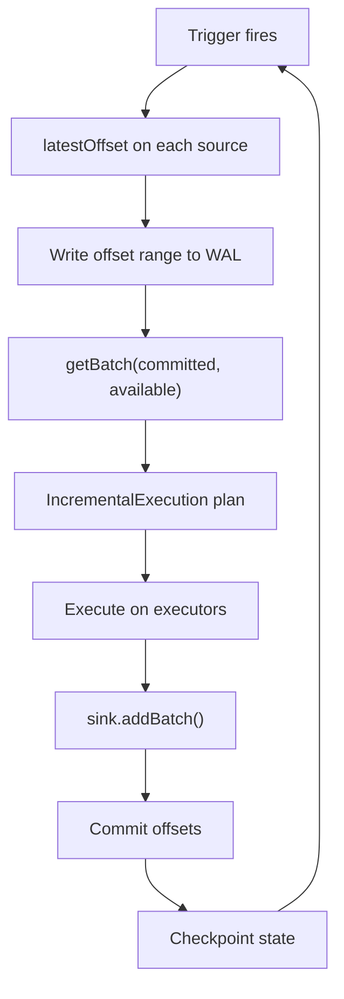
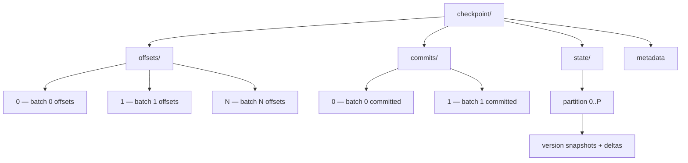

# Spark Structured Streaming
## Incremental Processing on a Batch Engine

**Data Engineering — Lecture 4**

2026-03-20

<!-- Speaker: Welcome students. Today we explore how Spark unifies batch and streaming through Structured Streaming — a declarative API that incrementalizes static queries. -->

<!-- Notes:
This lecture covers Spark Structured Streaming, the stream processing component of Apache Spark that treats streams as unbounded tables. The key insight is that developers write the same DataFrame/SQL queries they already know, and the engine automatically runs them incrementally. We will trace a running example — a clickstream pipeline reading from Kafka, computing windowed page-view counts, and writing to an Iceberg table — through every major concept: the execution model, exactly-once guarantees, watermarks, state management, and operational pitfalls. By the end, students should be able to design, deploy, and troubleshoot a production Structured Streaming application.
-->

---

## Agenda

1. Why unify batch and streaming?
2. The unbounded table model
3. Micro-batch execution engine
4. Exactly-once guarantees and checkpointing
5. Running example: clickstream pipeline
6. Watermarks and late data
7. Stateful operations and state stores
8. Micro-batch vs. Continuous vs. Flink
9. Operational pitfalls and table-format sinks
10. Summary and key takeaways

<!-- Speaker: Here is the roadmap. We start with the conceptual model, move to execution internals, then layer in correctness and state management, and finish with operational concerns. -->

<!-- Notes:
The lecture is structured to build understanding incrementally. Sections A and B establish the programming model and execution engine. Section C adds fault tolerance. Section D introduces the running example that threads through the remaining sections. Sections E and F cover the hardest conceptual material — watermarks and state. Section G contextualizes Spark against alternatives. Section H addresses what students will face in production. Each section builds on the previous one, so the order matters.
-->

---

<!-- _class: lead -->

## Section A: The Unbounded Table Model

---

## Motivation — Why Unify Batch and Streaming?

- **Old model (DStreams, Storm):** user builds a physical DAG of operators manually
- **Structured Streaming:** a purely declarative API that automatically incrementalizes a static relational query expressed using SQL or DataFrames [claim:sss:declarative_incrementalization:004]
- The developer focuses on **what** to compute, not **how** to process each micro-batch
- Core thesis from the SIGMOD 2018 paper: a relational API can automatically incrementalize static queries

<!-- Speaker: Contrast the old DStream/Storm model — where the user wires up physical operators — with Structured Streaming's declarative approach. The SIGMOD 2018 paper's core thesis is that a relational API can automatically incrementalize static queries. -->

<!-- Notes:
Before Structured Streaming, Spark offered DStreams (Discretized Streams), which exposed an RDD-level API where users manually defined transformations on each micro-batch. Storm and early Flink APIs similarly required building explicit operator DAGs. The problem was twofold: (1) users had to think about physical execution details like windowing mechanics and state management, and (2) the batch and streaming code paths were entirely separate, so a tested batch ETL pipeline could not simply be "turned on" as a streaming job. Structured Streaming's declarative approach — write a normal DataFrame query and let the engine incrementalize it — eliminates both problems. This was formalized in the Armbrust et al. SIGMOD 2018 paper, which is the primary academic reference for this system.
-->

---

## Stream as an Unbounded Table

- Structured Streaming treats a live data stream as a table that is being continuously appended — every arriving data item is like a new row appended to an unbounded Input Table [claim:sss:unbounded_table:001]
- Users express streaming computations as standard batch-like queries on a static table, and Spark runs them as incremental queries on the unbounded input table [claim:sss:batch_like_query:002]

<!-- Speaker: Draw the mental picture — every arriving record is a new row appended to an ever-growing Input Table. The user writes the same query they would write on a static table, and Spark runs it incrementally. -->

<!-- Notes:
This is the foundational mental model for everything that follows. Students should think of a Kafka topic (or any streaming source) not as a sequence of messages, but as a table that grows one row at a time. The "query" is a standard DataFrame transformation — filter, groupBy, join, etc. — written as if the entire table existed. Spark takes responsibility for figuring out how to run that query incrementally as new rows arrive. This abstraction is powerful because it means the same business logic (e.g., "count page views per URL per hour") works identically whether you run it on a static Hive table or a live Kafka stream. The only difference is how you read (spark.read vs. spark.readStream) and write (df.write vs. df.writeStream).
-->

---

## Same API, Batch and Streaming

- A query on a streaming DataFrame using the DataFrame/Dataset API is exactly the same as on a static DataFrame, allowing code reuse across batch and streaming workloads [claim:sss:same_api:003]
- Structured Streaming reuses Spark SQL's Catalyst optimizer and Tungsten code generation, so most optimizations — including predicate pushdown, projection pushdown, and expression simplification — apply automatically to streaming queries [claim:sss:catalyst_reuse:005]

```python
# Batch
df = spark.read.parquet("clicks/")
counts = df.groupBy("url").count()

# Streaming — same transformation, different I/O
df = spark.readStream.format("kafka").load()
counts = df.groupBy("url").count()
counts.writeStream.format("console").start()
```

<!-- Speaker: Emphasize that the DataFrame query is identical for batch and streaming. Most Catalyst and Tungsten optimizations apply automatically — zero extra work for the developer. -->

<!-- Notes:
The code example above illustrates the key selling point: the groupBy/count transformation is character-for-character identical between batch and streaming. Only the I/O layer changes (read vs. readStream, write vs. writeStream). Under the hood, the Catalyst optimizer applies the same rule-based and cost-based optimizations it uses for batch queries — predicate pushdown into sources, projection pruning, constant folding, join reordering, etc. Tungsten's code generation compiles the physical plan into optimized Java bytecode. This means streaming queries automatically benefit from most of the batch optimization work without any streaming-specific tuning. A common student misconception is that streaming queries are somehow "less optimized" than batch — in practice they go through the same optimizer pipeline, though not every optimization rule applies in the streaming context.
-->

---

## Incremental, Not Materialized

- The engine does **not** keep the entire unbounded table in memory — it reads the latest available data, processes it incrementally, keeps only minimal intermediate state, and discards the source data [claim:sss:incremental_state:006]
- Each micro-batch is executed via **IncrementalExecution**, a variant of QueryExecution that can preserve state between executions and injects streaming-specific planner strategies (StatefulAggregationStrategy, StreamingJoinStrategy, StreamingDeduplicationStrategy, among others) [claim:sss:incremental_execution:012]

<!-- Speaker: Clarify a key misconception — the engine does NOT keep the entire unbounded table in memory. It processes incrementally, keeps minimal state, and discards source data. -->

<!-- Notes:
This slide addresses the most common misunderstanding about the unbounded table model. When students hear "treat the stream as a table," many assume Spark materializes the entire history in memory. It does not. The engine only reads data that arrived since the last batch, processes it, updates any intermediate state (e.g., running counts for a groupBy), and throws away the raw input. The IncrementalExecution class is the key internal mechanism: it is a modified QueryExecution that knows how to (1) inject streaming-specific physical operators like StatefulAggregationStrategy, StreamingJoinStrategy, and StreamingDeduplicationStrategy, (2) optionally manage operator state across batches (stateless queries do not preserve state), and (3) propagate watermarks. The "minimal intermediate state" is exactly what makes watermarks important later — without them, "minimal" can still mean "unbounded" for certain queries.
-->

---

<!-- _class: lead -->

## Section B: Micro-Batch Execution

---

## Trigger Modes Overview

Structured Streaming supports four trigger modes [claim:sss:trigger_types:007]:

| Trigger | Behavior | Semantics |
|---------|----------|-----------|
| **ProcessingTime(interval)** | Fixed-interval micro-batches; 0 = as fast as possible | Exactly-once |
| **Once** *(deprecated 3.4)* | Single batch then stop | Exactly-once |
| **AvailableNow** | Multi-batch through all available data, then stop | Exactly-once |
| **Continuous(interval)** | Experimental low-latency; checkpoint at interval | At-least-once |

- Our running example uses `ProcessingTime("30 seconds")`
- AvailableNow replaced Once — better scalability for large backlogs

<!-- Speaker: Walk through all four trigger modes. ProcessingTime with 0 means as-fast-as-possible. Once is deprecated since 3.4. AvailableNow replaces it. Continuous is experimental with at-least-once. Our example uses ProcessingTime 30 seconds. -->

<!-- Notes:
ProcessingTime is the most common trigger in production. With a non-zero interval (e.g., 30 seconds), the engine waits for the interval to elapse before starting the next batch. With interval 0, it starts the next batch immediately after the previous one finishes — this gives minimum latency but maximum cluster utilization. Once was designed for "run once and stop" use cases (e.g., nightly catch-up jobs), but it loaded all available data into a single batch, which could OOM on large backlogs. AvailableNow (added in Spark 3.4) fixes this by splitting available data across multiple batches, processing all of it, then stopping — making it safe for large backlogs. Continuous mode is a fundamentally different execution model (long-running tasks instead of recurring batch jobs) that we will discuss in detail in Section G. Students should know that in practice, 95%+ of production Structured Streaming jobs use ProcessingTime.
-->

---

## The Micro-Batch Execution Loop



- Each iteration: discover offsets, log to WAL, fetch data, plan, execute, commit [claim:sss:microbatch_loop:008]
- Driver tracks **committedOffsets** (already processed) and **availableOffsets** (latest discovered) [claim:sss:offset_tracking:009]

<!-- Speaker: Present the diagram showing the full micro-batch loop. Trace one full iteration step by step — from trigger to checkpoint. -->

<!-- Notes:
This diagram is the heart of the execution model. Walk through it clockwise: (1) The trigger fires based on the configured interval. (2) The driver calls latestOffset() (or getOffset()) on each source (e.g., Kafka) to discover how much new data is available. (3) The offset range [committedOffsets, availableOffsets] is written to the OffsetSeqLog (the write-ahead log) BEFORE any processing begins — this is critical for exactly-once recovery. (4) getBatch() retrieves the actual data for that offset range from the source. (5) IncrementalExecution builds a physical plan with streaming-specific operators. (6) The plan executes across Spark executors. (7) The sink's addBatch() method writes output (e.g., to Iceberg, Kafka, or console). (8) The CommitLog records successful completion. (9) State is checkpointed asynchronously. Then the loop repeats. The two-phase logging (offsets before, commits after) is what enables exactly-once semantics on failure recovery, which we cover in the next section.
-->

---

## Offset Tracking Protocol

- The driver maintains **committedOffsets** (already processed and committed) and **availableOffsets** (latest discovered from sources) [claim:sss:offset_tracking:009]
- **OffsetSeqLog**: versioned files in HDFS-compatible storage, one per batch ID — written before execution begins [claim:sss:offset_seq_log:011]
- On restart, `populateStartOffsets` reads the latest committed batch to determine the resume point
- Offsets are source-specific: Kafka offsets, Kinesis sequence numbers, file modification timestamps, etc.

<!-- Speaker: Detail the committedOffsets vs. availableOffsets distinction. Explain OffsetSeqLog — versioned files in HDFS-compatible storage. On restart, populateStartOffsets reads the latest committed batch to determine where to resume. -->

<!-- Notes:
The offset tracking protocol is the foundation of Structured Streaming's fault tolerance. The driver holds two StreamProgress maps: committedOffsets tracks what has been fully processed and committed to the sink, while availableOffsets tracks the latest data discovered from each source. The OffsetSeqLog persists these ranges as numbered files (one per batch ID) on HDFS, S3, or any Hadoop-compatible filesystem. Crucially, this log is written BEFORE the batch executes — so if the driver crashes mid-batch, the log tells the recovered driver exactly which offset range to replay. The populateStartOffsets method, called during recovery, reads the latest entry in the OffsetSeqLog and compares it with the CommitLog to determine whether the last batch completed or needs replaying. Students sometimes confuse this with Kafka's consumer group offsets — Structured Streaming does NOT use Kafka's consumer group protocol for offset management; it manages offsets independently via the checkpoint.
-->

---

## Micro-Batch Latency

- The default micro-batch engine processes data as a series of small batch jobs, achieving end-to-end latencies **as low as ~100 milliseconds** with exactly-once guarantees [claim:sss:microbatch_latency:013]
- Latency floor is driven by:
  - Task scheduling overhead between batches
  - Offset discovery and WAL writes
  - State checkpointing
- For sub-100 ms latency, see Continuous mode (Section G) or Apache Flink

<!-- Speaker: Set expectations — approximately 100 ms end-to-end latency is the practical floor for micro-batch due to task launch and scheduling overhead between batches. -->

<!-- Notes:
The ~100 ms figure comes directly from the Spark documentation and represents the best case under optimal conditions (small data volumes, fast source, fast sink, minimal state). In practice, most production jobs see latencies of 1-30 seconds depending on data volume, query complexity, state size, and trigger interval. The overhead comes from multiple sources: the driver must discover offsets, write to the WAL, plan the query, schedule tasks across the cluster, and wait for all tasks to complete before committing. Each of these steps adds milliseconds to tens of milliseconds. This is a fundamental architectural constraint of micro-batch processing — you cannot avoid the per-batch coordination overhead. For applications requiring sub-100 ms latency (e.g., fraud detection, real-time bidding), Spark's experimental Continuous mode or Apache Flink's per-event model are better choices, as we discuss later.
-->

---

<!-- _class: lead -->

## Section C: Exactly-Once Guarantees and Checkpointing

---

## WAL-Based Exactly-Once Protocol

- Two persistent logs in the checkpoint directory, combined with replayable sources and idempotent sinks, provide end-to-end exactly-once guarantees [claim:sss:wal_exactly_once:010]:
  1. **OffsetSeqLog** — records offset range *before* execution begins
  2. **CommitLog** — records successful completion *after* sink output
- On failure: compare the two logs, find uncommitted batch, **replay it**
- Requires:
  - **Replayable sources** (Kafka, Kinesis, files) — can re-read the same offset range
  - **Idempotent sinks** (Delta, Iceberg, Kafka with dedup) — replayed writes produce same result

<!-- Speaker: Walk through the two-log protocol. On failure, compare OffsetSeqLog and CommitLog to find the uncommitted batch and replay it. Emphasize that exactly-once requires all three: the two logs, replayable sources, and idempotent sinks. -->

<!-- Notes:
The exactly-once guarantee rests on three pillars: (1) the two-log WAL protocol on the driver, (2) replayable sources, and (3) idempotent sinks. The protocol works as follows: before a batch executes, the OffsetSeqLog records "I intend to process offsets X through Y." After the batch successfully writes to the sink, the CommitLog records "Batch N completed." If the driver crashes between these two writes, the recovered driver sees that offsets were logged but not committed, and replays the batch. For this to be truly exactly-once (not just at-least-once), the source must be able to re-read the exact same offset range (Kafka can do this; a TCP socket cannot), and the sink must handle duplicate writes idempotently (Delta Lake's transaction log handles this; appending to a raw file does not). A common exam question: "Is exactly-once guaranteed with a Kafka source and a console sink?" Answer: No — the console sink is not idempotent, so replayed batches produce duplicate output.
-->

---

## Checkpoint Directory Layout



- **offsets/**: one file per batch, written at batch **start** [claim:sss:checkpoint_layout:029]
- **commits/**: one file per batch, written at batch **end**
- **state/**: partitioned state store snapshots for stateful operators
- **metadata**: query ID and configuration

<!-- Speaker: Show the directory tree. On recovery, the engine compares offsets vs. commits to find incomplete batches. -->

<!-- Notes:
The checkpoint directory is a critical piece of infrastructure that students must understand for operational work. The offsets/ directory contains one file per batch ID (0, 1, 2, ...), each storing the source offsets for that batch. These files are written atomically before execution starts. The commits/ directory mirrors this structure but is written after the sink confirms successful output. On recovery, if offsets/5 exists but commits/5 does not, the engine knows batch 5 was interrupted and must be replayed. The state/ directory is organized by state store partition and contains versioned snapshots and delta files — this is how stateful operators (aggregations, joins, deduplication) survive failures. The metadata file records the query's unique ID and run ID, which prevents accidentally resuming the wrong query from a shared checkpoint location. Students should know that deleting or corrupting the checkpoint directory means losing all processing progress and state — it is effectively the "database" of the streaming application.
-->

---

## Recovery Semantics

- On restart, the engine restores state from fault-tolerant storage and resumes from the last committed offset [claim:sss:state_checkpoint_recovery:030]
- Stateful operators checkpoint asynchronously, tagged with the batch version
- **Critical constraint:** changes to stateful operations (additions, deletions, schema modifications) are **forbidden** between restarts
- Recovery sequence:
  1. Read metadata — restore query ID
  2. Read latest offset and commit logs — determine resume point
  3. Restore state store to matching version
  4. Replay uncommitted batch (if any)
  5. Resume normal processing

<!-- Speaker: On restart, the engine restores state from fault-tolerant storage and resumes from the last committed offset. Crucially, changes to stateful operations between restarts are forbidden. -->

<!-- Notes:
The recovery process is automatic but imposes strict constraints. The engine reads the checkpoint metadata to verify it is resuming the correct query, then compares the offset and commit logs to find the resume point. If there is an uncommitted batch, it replays it (relying on source replayability and sink idempotency). State stores are restored to the version matching the last committed batch — each state store partition loads its latest snapshot and applies any delta files needed to reach the correct version. The "no changes to stateful operations" constraint is the most operationally painful aspect of Structured Streaming. If you need to add a new aggregation column, change a window size, or modify a join condition, you cannot simply restart — you must create a new checkpoint (losing all accumulated state) or implement a migration strategy. This constraint exists because state is serialized with a fixed schema; changing the schema would make existing checkpointed state unreadable.
-->

---

<!-- _class: lead -->

## Section D: Running Example — Clickstream Pipeline

---

## Running Example Introduction

**Scenario:** Real-time clickstream analytics for a web application

- **Source:** Kafka topic `clickstream` with fields: `user_id`, `url`, `event_time`
- **Goal:** 10-minute tumbling-window page-view counts per URL
- **Watermark:** 5 minutes (tolerate up to 5 min of late data)
- **Sink:** Apache Iceberg table `analytics.page_views`
- **Trigger:** ProcessingTime("30 seconds")

This example threads through the rest of the lecture — we will trace it through
watermarks, state management, and operational pitfalls.

<!-- Speaker: Introduce the scenario — clickstream from a web app over Kafka. We compute 10-minute tumbling-window page-view counts per URL with a 5-minute watermark, writing to Iceberg. This example threads through the rest of the lecture. -->

<!-- Notes:
This is a realistic production scenario that many data engineering teams implement. The clickstream topic receives events every time a user visits a page — each event has a user_id, the URL they visited, and the event_time (when the click actually occurred, which may differ from when Kafka received it due to mobile clients, network delays, etc.). We want to count how many times each URL was viewed in 10-minute windows (e.g., 12:00-12:10, 12:10-12:20). The 5-minute watermark means we tolerate clicks arriving up to 5 minutes late — a click from 12:08 can arrive at 12:13 and still count. Writing to Iceberg (rather than a file sink or console) represents a production-grade setup where analysts can query the results with standard SQL. The 30-second trigger interval means we update results at most twice per minute — a reasonable tradeoff between latency and resource usage.
-->

---

## Complete Clickstream Query

```python
from pyspark.sql import SparkSession
from pyspark.sql.functions import from_json, col, window
from pyspark.sql.types import StructType, StringType, TimestampType

spark = SparkSession.builder.appName("ClickstreamPipeline").getOrCreate()

schema = StructType() \
    .add("user_id", StringType()) \
    .add("url", StringType()) \
    .add("event_time", TimestampType())

# Read from Kafka — stream as unbounded table [claim:sss:unbounded_table:001]
clicks = (
    spark.readStream
    .format("kafka")
    .option("kafka.bootstrap.servers", "broker:9092")
    .option("subscribe", "clickstream")
    .load()
    .select(from_json(col("value").cast("string"), schema).alias("data"))
    .select("data.*")
)

# Same groupBy/count as batch — Spark incrementalizes it [claim:sss:batch_like_query:002]
page_views = (
    clicks
    .withWatermark("event_time", "5 minutes")  # [claim:sss:withwatermark_api:024]
    .groupBy(window("event_time", "10 minutes"), "url")
    .count()
)

# Write to Iceberg with exactly-once checkpoint
(
    page_views.writeStream
    .format("iceberg")
    .outputMode("append")
    .option("checkpointLocation", "/checkpoints/clickstream_pageviews")
    .trigger(processingTime="30 seconds")
    .toTable("analytics.page_views")
)
```

<!-- Speaker: Walk through every line — readStream from Kafka, parse JSON, withWatermark, groupBy window + URL, count, writeStream to Iceberg. Point out this is the same code as a batch groupBy, plus watermark and writeStream. -->

<!-- Notes:
Let us trace through this code: (1) We define the schema for our Kafka messages — user_id, url, and event_time. (2) spark.readStream.format("kafka") creates a streaming DataFrame representing the unbounded Kafka topic. The .load() returns rows with key, value, topic, partition, offset, and timestamp columns — we extract the value, cast it to string, and parse the JSON. (3) withWatermark("event_time", "5 minutes") tells the engine that events can arrive up to 5 minutes late. This MUST come before the groupBy. (4) The groupBy uses Spark's window() function to create 10-minute tumbling windows on event_time, then groups by both the window and the URL. The .count() aggregation is identical to what you would write in batch. (5) writeStream with outputMode("append") means results are emitted only after the watermark passes (final counts only). The checkpoint location is mandatory for fault tolerance. The 30-second processing-time trigger means the engine checks for new Kafka data every 30 seconds. Note: in a real deployment, you would also configure Kafka consumer options (maxOffsetsPerTrigger, startingOffsets) and Iceberg table properties.
-->

---

## What Happens Under the Hood

For each 30-second micro-batch of our clickstream query:

1. **Offset discovery:** Driver queries Kafka for latest offsets across all partitions
2. **WAL write:** Offset range logged to checkpoint before processing [claim:sss:microbatch_loop:008]
3. **getBatch:** New click events fetched from Kafka for offset range
4. **IncrementalExecution:** Plan built with `StatefulAggregationStrategy` — window counts updated in state store [claim:sss:incremental_execution:012]
5. **Sink write:** Updated/finalized window counts written to Iceberg table
6. **Commit:** Offsets committed, state checkpointed

Each batch only processes **new** clicks — state store holds partial window counts between batches.

<!-- Speaker: Trace one micro-batch of the clickstream query through the execution loop — Kafka offsets discovered, IncrementalExecution builds plan with StatefulAggregationStrategy, window counts updated in state store, results written to Iceberg. -->

<!-- Notes:
This slide connects the abstract execution loop from Section B to our concrete example. When the 30-second trigger fires, the driver calls Kafka's latestOffset() to discover that, say, partitions 0-7 have new data at offsets 1000-1050, 2000-2030, etc. This offset range is written to the OffsetSeqLog. Then getBatch() fetches the actual click events for that range. IncrementalExecution creates a physical plan: the StatefulAggregationStrategy operator maintains a state store where each key is (window, url) and the value is the running count. For each incoming click, the operator looks up the corresponding window and URL in state, increments the count, and writes it back. If the watermark has passed a window's end time and we are in Append mode, that window's final count is emitted to the Iceberg sink and the state entry is deleted. The Iceberg sink writes a new data file and commits a new table snapshot. Finally, the CommitLog records success. Students should understand that the state store is what makes this incremental — without it, we would need to re-scan all historical data every batch.
-->

---

<!-- _class: lead -->

## Section E: Watermarks and Late Data

---

## The Late Data Problem — Unbounded State

- Without watermarks, the system must keep state for **every window since the application began** because a late record might arrive for any window [claim:sss:watermark_state_bound:020]
- Example: counting by 1-minute windows x URL
  - After 1 day: 1,440 windows x thousands of URLs = **millions of state entries**
  - After 1 week: **tens of millions** of entries
  - State grows without bound — OOM inevitable

<!-- Speaker: Without watermarks, every window since the application began must be kept in state because a late record could arrive for any window — state grows without bound. -->

<!-- Notes:
This slide motivates why watermarks exist. Consider our clickstream example without a watermark: the system computes page-view counts for 10-minute windows. After one day, there are 144 windows. After a week, 1,008 windows. After a month, roughly 4,320 windows. Each window is further grouped by URL — if there are 10,000 unique URLs, that is 43.2 million state entries after one month. And the system can never discard any of them, because in principle a click event with event_time from three weeks ago could arrive (perhaps a mobile app cached it offline). This is not a theoretical concern — it is the number one cause of OOM failures in production streaming applications. Watermarks solve this by giving the engine permission to discard state for windows that are "old enough" that we no longer expect late data for them.
-->

---

## Watermark Definition

- **Watermark** = max(event_time) - threshold [claim:sss:watermark_definition:019]
  - `max(event_time)`: maximum event time seen so far across all data
  - `threshold`: user-specified delay tolerance (e.g., "5 minutes")
- **Naturally robust to backlog:** if the system cannot keep up with the input rate, the watermark does not advance arbitrarily — it is anchored to the data actually processed
- In our example: `withWatermark("event_time", "5 minutes")`
  - If max event_time seen is 12:30, watermark = **12:25**

<!-- Speaker: Define watermark = max(event_time) minus threshold. Emphasize natural robustness to backlog — if the system cannot keep up, the watermark will not advance. -->

<!-- Notes:
The watermark formula is simple but its implications are subtle. The watermark is a global, monotonically non-decreasing value computed as the maximum event time observed minus the user-specified threshold. It represents the engine's assertion that "I do not expect to see any more data with event_time earlier than this value." The backlog robustness property is particularly elegant: imagine the system falls behind and has a 2-hour backlog of unprocessed data. Because the watermark is based on max(event_time) of PROCESSED data (not wall-clock time), it only advances as data is actually consumed. This means data is not incorrectly discarded during catch-up — the watermark stays "behind" until the backlog is cleared. Contrast this with wall-clock-based watermarks (used in some other systems) where a processing delay could cause the watermark to jump forward and incorrectly discard buffered data. The SIGMOD 2018 paper (Section 4.3.1) specifically calls out this design choice.
-->

---

## withWatermark() API and Placement Rules

The withWatermark() API takes two arguments: the event-time column and the delay threshold [claim:sss:withwatermark_api:024]

```python
# CORRECT: withWatermark on the same column as the aggregation,
# placed BEFORE the groupBy
clicks \
    .withWatermark("event_time", "5 minutes") \
    .groupBy(window("event_time", "10 minutes"), "url") \
    .count()
```

```python
# INVALID: withWatermark AFTER groupBy — has no effect
clicks \
    .groupBy(window("event_time", "10 minutes"), "url") \
    .count() \
    .withWatermark("event_time", "5 minutes")  # Too late!
```

```python
# INVALID: withWatermark on different column than aggregation
clicks \
    .withWatermark("ingest_time", "5 minutes") \
    .groupBy(window("event_time", "10 minutes"), "url") \
    .count()  # Watermark on wrong column!
```

<!-- Speaker: Show correct and incorrect placement — withWatermark must be on the same column as the aggregation and must precede the groupBy in the query plan. -->

<!-- Notes:
These placement rules are the most common source of bugs in Structured Streaming applications. Rule 1: withWatermark must be called on the SAME column that appears in the aggregation's time window. If you watermark on "ingest_time" but window on "event_time," the watermark has no effect on state cleanup for that aggregation. Rule 2: withWatermark must appear BEFORE the groupBy in the logical plan. Calling it after the aggregation is a no-op because the watermark needs to be in scope when the aggregation operator is planned. Rule 3: calling withWatermark on a non-streaming (batch) DataFrame is silently ignored — it does not raise an error, which can be confusing during testing. A useful debugging technique is to check the query's logical plan (query.explain()) to verify the watermark is correctly attached to the EventTimeWatermark node in the plan tree.
-->

---

## How Watermarks Clean Up State

- In **Append mode**: engine holds partial counts, waits for watermark to pass the window end, then emits final result and **drops the window's state** [claim:sss:watermark_state_cleanup:021]
- The guarantee is **one-sided** [claim:sss:watermark_guarantee:022]:
  - Data within the threshold: **never dropped** (guaranteed)
  - Data beyond the threshold: **may or may not** be processed (not guaranteed)

```
Watermark = 12:25 (max seen 12:30, threshold 5 min)

Window [12:20-12:30]  ->  OPEN (12:30 > 12:25, still accepting data)
Window [12:10-12:20]  ->  CLOSED (12:20 < 12:25, emit + drop state)
Window [12:00-12:10]  ->  CLOSED (already emitted and dropped)
```

<!-- Speaker: In Append mode, the engine holds partial counts until the watermark passes the window end, then emits and drops state. The guarantee is one-sided — within the threshold: never dropped; beyond: may or may not be processed. -->

<!-- Notes:
The one-sided guarantee is subtle and frequently tested. Consider a 5-minute watermark with max event_time of 12:30 (watermark = 12:25). The key insight is that state cleanup is based on the WINDOW END time falling below the watermark, not individual event times. The [12:20-12:30] window has end time 12:30, which is above the watermark 12:25, so it stays open — any late click falling in this window will still be counted. The [12:10-12:20] window has end time 12:20, which is below the watermark 12:25, so it IS closed — its final count is emitted and state is dropped. The guarantee says: data arriving within the threshold of the max event time (i.e., event_time > 12:25) is NEVER dropped. Data arriving beyond the threshold (event_time < 12:25) is not guaranteed — it depends on whether the window's state has already been cleaned up. More delayed data is less likely to be processed because the window is more likely to have been closed already.
-->

---

## Watermarks and Output Modes

| | **Append** | **Update** | **Complete** |
|---|---|---|---|
| **When results emitted** | Once, after watermark passes window end | Each trigger (partial results) | Each trigger (full result table) |
| **State cleanup** | Yes — after emit | Yes — watermark drops old state | **No** — all state kept forever |
| **Duplicate output rows** | No | Yes (updated counts) | Yes (entire table) |
| **Use case** | Final results to immutable sink (Iceberg, files) | Dashboard / real-time updates | Small result sets, interactive queries |

Watermarks interact differently with each output mode: Append emits final results enabling state cleanup; Update emits partials with watermark-based cleanup; Complete never cleans state [claim:sss:watermark_output_modes:023]

**Our clickstream example uses Append mode** — write final window counts to Iceberg.

<!-- Speaker: Three-column comparison of output modes. For the clickstream example writing to Iceberg, Append is the right choice because Iceberg expects immutable appends of final results. -->

<!-- Notes:
The choice of output mode has profound implications for both correctness and resource usage. Append mode is the most common for production pipelines because it emits each result exactly once (after the watermark guarantees no more updates), making it compatible with immutable sinks like Iceberg, Delta Lake, and file systems. The tradeoff is latency — results are delayed by the watermark threshold. Update mode emits partial results every trigger, which is great for dashboards but means downstream consumers see changing values for the same window. It still cleans state via watermarks. Complete mode is the most resource-intensive because it re-emits the ENTIRE result table every trigger and never discards state — it is only viable for small result sets (e.g., a handful of aggregation keys). A common mistake is using Complete mode with a high-cardinality grouping key (like URL in our example) — state will grow without bound regardless of the watermark, because Complete mode must preserve all results for re-emission.
-->

---

## Late Data Scenario Walkthrough

**Clickstream example:** max event_time = 12:30, watermark = 12:25 (5-min delay)

| Event | event_time | vs. Watermark | Window | Result |
|-------|-----------|---------------|--------|--------|
| Click A | 12:28 | Above (12:28 > 12:25) | [12:20-12:30] | Counted normally |
| Click B | 12:22 | Below (12:22 < 12:25) | [12:20-12:30] | Still counted — window open |
| Click C | 12:18 | Below (12:18 < 12:25) | [12:10-12:20] | **Not guaranteed** — window may be closed |

- Data within the threshold is **never dropped** [claim:sss:watermark_guarantee:022]
- Window [12:10-12:20] emitted and state dropped once watermark passes 12:20 [claim:sss:watermark_state_cleanup:021]
- The watermark is computed as max(event_time) - threshold = 12:30 - 5 min = 12:25 [claim:sss:watermark_definition:019]

<!-- Speaker: Walk through a concrete timeline using the clickstream example. Trace which clicks are guaranteed to be counted and which windows get closed. -->

<!-- Notes:
This walkthrough makes the watermark mechanics concrete. Click A at 12:28 is straightforward — it falls in the [12:20-12:30] window which is still open, and 12:28 is above the watermark, so it is definitely counted. Click B at 12:22 is more interesting — it is BELOW the watermark (12:22 < 12:25) meaning it arrived "late," but the window [12:20-12:30] has end time 12:30 which is ABOVE the watermark, so the window is still open and accepting data. Click B is counted. Click C at 12:18 falls in window [12:10-12:20] with end time 12:20, which is BELOW the watermark 12:25. This window may have already been emitted and its state dropped. If it has, Click C is silently discarded. If processing happened to be slightly delayed such that the window had not yet been cleaned, Click C might still be counted — but there is no guarantee. This is the "one-sided" guarantee in action: the engine guarantees it will not drop data less than 5 minutes late, but data more than 5 minutes late has no guarantee in either direction.
-->

---

<!-- _class: lead -->

## Section F: Stateful Operations and State Stores

---

## Built-In Stateful Operations

Three families of stateful operations:

1. **Windowed aggregations** — `groupBy(window(...)).agg(...)` — our clickstream example
2. **Stream-stream joins** — buffer both sides as state; inner joins optionally use watermarks, outer joins **require** them to bound state and emit NULLs [claim:sss:stream_joins:026]
3. **Arbitrary stateful processing** — `mapGroupsWithState` / `flatMapGroupsWithState` for custom logic like sessionization [claim:sss:stateful_ops:025]

All stateful operations maintain state in **state stores** (next slide) and require a **checkpoint** for fault tolerance.

<!-- Speaker: Three families — windowed aggregations, stream-stream joins (inner: watermarks optional; outer: required), and arbitrary stateful processing via mapGroupsWithState for sessionization and similar use cases. -->

<!-- Notes:
Each family has different state management characteristics. Windowed aggregations (like our clickstream groupBy/count) maintain one state entry per (window, grouping key) combination — the watermark controls when state is cleaned. Stream-stream joins are more complex: both sides of the join buffer their input as state, so every incoming row from the left stream can match with any past or future row from the right stream. For inner joins, watermarks are optional — without them, state grows forever but no rows are lost. For outer joins, watermarks are mandatory because the engine needs to know when an unmatched row will never find a match, so it can emit the NULL-padded result. mapGroupsWithState and flatMapGroupsWithState are the escape hatches for arbitrary logic: you define a state type, an update function, and optionally a timeout — the engine calls your function for each group with new data and current state. flatMapGroupsWithState is "more powerful" because it can output zero or more rows per group per trigger, supports both processing-time and event-time timeouts, and allows Append output mode.
-->

---

## State Store — HDFS-Backed vs. RocksDB

| | **HDFS-Backed** (default) | **RocksDB** (since Spark 3.2) |
|---|---|---|
| **Storage** | JVM heap HashMap | Native (off-heap) memory + local disk |
| **Scale** | Millions of keys — GC pauses | **100M+ keys** per executor [claim:sss:state_store_growth:033] |
| **GC impact** | High — large heap causes long pauses | Low — state is off-heap |
| **Memory control** | JVM heap size only | Explicit memory bounding strongly recommended |

The default HDFS-backed store keeps all state in JVM heap, causing GC pauses with millions of keys [claim:sss:hdfs_state_store:027]. RocksDB uses native memory and local disk, scaling to 100M keys per executor [claim:sss:state_store_growth:033]; explicit memory bounds are strongly recommended to prevent OOM [claim:sss:rocksdb_state_store:028]. Without bounds, RocksDB memory can grow indefinitely and potentially cause OOM [claim:sss:rocksdb_state_store:028].

```python
# Enable RocksDB state store
spark.conf.set(
    "spark.sql.streaming.stateStore.providerClass",
    "org.apache.spark.sql.execution.streaming.state.RocksDBStateStoreProvider"
)
```

<!-- Speaker: Compare HDFS-backed (default, in-heap, simple but GC-prone) vs. RocksDB (off-heap, scales to 100M keys). Explicit memory bounding is strongly recommended to prevent OOM. Show the config to enable RocksDB. -->

<!-- Notes:
The state store choice is one of the most impactful configuration decisions for production streaming applications. The default HDFSBackedStateStore is simple: it is a Java HashMap in memory, periodically serialized to HDFS. This works well for small state (thousands to low millions of keys) but degrades badly at scale because Java's garbage collector must traverse the entire heap to identify live objects. With tens of millions of state entries, GC pauses can exceed the trigger interval, causing cascading delays. The RocksDB state store (added in Spark 3.2) solves this by storing state in RocksDB's native memory and SSD-backed LSM tree, which is invisible to the JVM garbage collector. It can handle 100 million keys per executor. However, it introduces a new operational concern: RocksDB's memory usage must be explicitly bounded via configuration (e.g., spark.sql.streaming.stateStore.rocksdb.blockCacheSizeMB). Without bounds, each RocksDB instance grows as data accumulates, and with multiple state stores per executor (one per partition), total memory can exceed the container limit. For our clickstream example, with potentially millions of (window, URL) combinations, RocksDB is the recommended choice.
-->

---

<!-- _class: lead -->

## Section G: Micro-Batch vs. Continuous vs. Flink

---

## Comparison — Micro-Batch vs. Continuous vs. Flink

| | **Spark Micro-Batch** | **Spark Continuous** | **Apache Flink** |
|---|---|---|---|
| **Latency** | as low as ~100 ms [claim:sss:microbatch_latency:013] | ~1 ms [claim:sss:continuous_mode_latency:014] | Per-event, low ms |
| **Semantics** | Exactly-once | At-least-once | Exactly-once |
| **Operators** | Full SQL + stateful | Map-like only [claim:sss:continuous_ops_limited:015] | Full stateful |
| **Execution** | Recurring short jobs | Long-running tasks [claim:sss:continuous_long_running:016] | Pipelined operators |
| **Failure** | Auto retry per batch | No auto retry — query stops | Per-event checkpointing |
| **State** | Checkpoint-based | N/A (no stateful ops) | Local + async checkpoint |

Flink processes per-event through pipelined operators with local state and asynchronous checkpointing [claim:sss:flink_per_event:018]

<!-- Speaker: Three-column comparison of Spark Micro-Batch, Spark Continuous, and Flink. Discuss latency, guarantees, operator support, and failure handling tradeoffs. -->

<!-- Notes:
This comparison helps students understand the design space. Spark Micro-Batch is the pragmatic default: it piggybacks on Spark's mature batch engine, getting exactly-once semantics and full SQL support at the cost of ~100 ms minimum latency. Spark Continuous tried to reduce latency to ~1 ms by running long-lived tasks (like Flink), but only supports map-like operations — no aggregations, no joins, no stateful processing — which severely limits its usefulness. It also lacks automatic task retry, making it fragile. Apache Flink takes a fundamentally different approach: it is a native streaming engine where each operator processes events one at a time through a pipelined DAG. Flink achieves exactly-once via asynchronous barrier checkpointing (inspired by Chandy-Lamport), where checkpoint barriers flow through the data stream, triggering operators to snapshot their state. This gives Flink low latency AND exactly-once AND full stateful support — but it is a completely separate ecosystem from Spark, so organizations using Spark for batch must maintain two platforms.
-->

---

## Why Continuous Processing Never Graduated

Spark's Continuous Processing mode never advanced beyond experimental status [claim:sss:continuous_never_graduated:017]:

1. **Only map-like operations** — no aggregations, no joins, no stateful processing [claim:sss:continuous_ops_limited:015]
2. **Long-running tasks with no automatic retries** — any failure stops the query [claim:sss:continuous_long_running:016]
3. **Would require two separate checkpointing systems** — one for micro-batch, one for continuous
4. **Significant engine reimplementation** needed to support stateful operators in continuous mode

**Bottom line:** For very low per-event latency with full stateful support, Flink is the production-ready choice. For Spark users, micro-batch at as low as ~100 ms covers most use cases.

<!-- Speaker: Three blockers kept Continuous from graduating — limited operators, no auto retry, and the engineering cost of maintaining parallel execution engines. It remains experimental and is not recommended for production. -->

<!-- Notes:
The history of Continuous Processing is instructive for understanding engineering tradeoffs. When it was introduced in Spark 2.3 (2018), the vision was ambitious: keep the same Structured Streaming API but switch execution to a Flink-like model for low latency. In practice, the implementation only covered the simplest case — stateless map/filter/project operations on Kafka or Rate sources. Extending it to stateful operations would have required reimplementing the state management, checkpointing, and watermark propagation systems for long-running tasks — essentially building a second streaming engine inside Spark. The Spark community evaluated this in a SPIP (Spark Project Improvement Proposal) and concluded the engineering cost was not justified, especially given that micro-batch latency of ~100 ms serves the vast majority of use cases. For the small percentage of applications requiring very low per-event latency, the recommendation is to use Flink. As of Spark 4.x, Continuous Processing remains in the codebase but has received no significant development.
-->

---

<!-- _class: lead -->

## Section H: Operational Pitfalls

---

## The Small-File Problem

- Each micro-batch writes separate output files — long-running jobs accumulate **thousands of small files** [claim:sss:small_file_problem:031]
- File-sink `_spark_metadata` log grows unbounded — eventual **driver OOM**
- With Iceberg, each batch produces a **new snapshot** with small data files [claim:sss:iceberg_streaming_maintenance:036]

**Mitigations:**
- Increase trigger interval (e.g., 30s to 5 min) to reduce file count
- Run periodic **compaction** on the Iceberg table
- **Expire old snapshots** to limit metadata growth
- Consider Delta Lake's **auto-compaction** for simpler operations

<!-- Speaker: Each micro-batch writes separate files. With Iceberg, each batch creates a new snapshot with small files. Mitigations: increase trigger interval, run compaction, expire snapshots. -->

<!-- Notes:
The small-file problem is the most common operational issue in production Structured Streaming pipelines. With a 30-second trigger, a streaming job produces 2,880 batches per day, each writing one or more files per output partition. After a week, that is 20,000+ small files. For the built-in FileStreamSink, Spark maintains a _spark_metadata folder that logs every file written per batch — this log is loaded into driver memory on startup and never truncated, eventually causing OOM. For Iceberg sinks, the problem manifests differently: each batch commits a new table snapshot with its own manifest and data files, bloating the metadata layer. Mitigations are operational, not code changes: (1) use a longer trigger interval to produce fewer, larger files; (2) run Iceberg's rewriteDataFiles action periodically (e.g., hourly) to merge small files into larger ones; (3) run expireSnapshots to remove metadata for old snapshots; (4) run rewriteManifests to consolidate manifest files. Delta Lake handles this more gracefully with built-in auto-compaction that merges small files synchronously after writes.
-->

---

## State Store Growth Under Skewed Keys

- Skewed keys cause uneven state distribution — one executor holds disproportionate state [claim:sss:state_store_growth:033]
- With HDFS store: JVM heap pressure — long GC pauses — cascading batch delays
- With RocksDB: unbounded memory growth — potential OOM if not bounded [claim:sss:rocksdb_state_store:028]

**Mitigations:**
- **Salt keys** to redistribute state across partitions
- Switch to **RocksDB** with explicit memory bounds
- Monitor state metrics via `StreamingQueryListener`
- Set appropriate **watermarks** to bound state lifetime

```python
# Monitor state size via listener
class StateMonitor(StreamingQueryListener):
    def onQueryProgress(self, event):
        for state_op in event.progress.stateOperators:
            print(f"State rows: {state_op.numRowsTotal}")
```

<!-- Speaker: Skewed keys cause uneven state distribution. Mitigate with key salting, RocksDB with memory bounds, monitoring via StreamingQueryListener, and appropriate watermarks. -->

<!-- Notes:
State skew is a production killer that does not show up in development or testing with small data. Imagine our clickstream example where one URL (say, the homepage) receives 80% of all traffic. Because state is hash-partitioned by the grouping key (window, url), the partition containing the homepage key holds 80% of the state while other partitions are nearly empty. With the HDFS-backed store, this means one executor's JVM heap is under enormous pressure while others are idle — the GC pauses on that executor slow down the entire batch because Spark waits for all tasks to complete. With RocksDB, the memory growth on that executor can exceed the container's memory limit. Key salting (appending a random suffix to the key, then aggregating twice — once with salt, once without) redistributes state but adds complexity. StreamingQueryListener is the primary monitoring interface: the onQueryProgress callback provides stateOperators metrics including numRowsTotal, memoryUsedBytes, and customMetrics. In production, these should be exported to a monitoring system (Prometheus, CloudWatch, etc.) with alerts on growth rate.
-->

---

## Checkpoint Compatibility — What You Can and Cannot Change

| **Safe Changes** (keep checkpoint) | **Breaking Changes** (new checkpoint required) |
|---|---|
| Add/remove filters | Change `spark.sql.shuffle.partitions` |
| Change rate limits | Change state store provider |
| Change trigger interval | Change watermark policy |
| Modify non-stateful projections | Add/remove/modify stateful operations |
| | Change number or type of sources |
| | Switch output sink type |

Changes to stateful operations and critical configurations are forbidden between restarts [claim:sss:checkpoint_compatibility:032]. Safe changes include adding filters and changing trigger intervals [claim:sss:checkpoint_allowed_changes:035].

**Key insight:** `shuffle.partitions` is frozen because state is **hash-partitioned** — changing partition count would orphan existing state.

<!-- Speaker: Two-column table of safe vs. breaking changes. Emphasize that shuffle.partitions is frozen because state is hash-partitioned. -->

<!-- Notes:
Checkpoint compatibility is arguably the most painful operational aspect of Structured Streaming. The checkpoint encodes not just offsets and state, but also the physical structure of the query: how many partitions, which state store provider, which stateful operations, and their schemas. Changing any of these requires a new checkpoint, which means losing all accumulated state and restarting from scratch (or from the earliest available Kafka offset). The shuffle.partitions constraint is particularly surprising to newcomers: if you start a query with 200 partitions, each state store partition is a separate directory containing state for keys that hash to that partition. If you change to 400 partitions, the hash function maps keys to different partitions, so the engine cannot find existing state — it would silently produce incorrect results if allowed. Safe changes are limited to operations that do not affect the physical plan's stateful structure: adding a filter just reduces input data, changing the trigger interval just changes timing, and rate limits just cap how much data is read per batch. When deploying schema changes or new aggregation logic, teams typically maintain the old and new queries in parallel during a transition period.
-->

---

## Table-Format Sinks — Delta Lake and Iceberg

**Delta Lake:**
- Transaction log guarantees **exactly-once** even with concurrent writers [claim:sss:delta_streaming_sink:034]
- **Auto-compaction** merges small files synchronously after writes — minimal maintenance

**Apache Iceberg (our clickstream example):**
- Requires explicit maintenance [claim:sss:iceberg_streaming_maintenance:036]:
  - Tune commit rate to reduce snapshot frequency
  - Run `expire_snapshots` to remove old metadata
  - Run `rewrite_data_files` to compact small files
  - Run `rewrite_manifests` to consolidate manifest files
- Each batch produces a new snapshot with new small data files leading to metadata bloat

**Recommendation:** Choose Delta Lake for simpler operations; choose Iceberg for multi-engine interoperability (Spark + Trino + Flink).

<!-- Speaker: Delta Lake provides auto-compaction and exactly-once via its transaction log. Iceberg requires explicit maintenance — tune commits, expire snapshots, compact files. Tie back to our clickstream example. -->

<!-- Notes:
Both Delta Lake and Iceberg solve the same fundamental problem — providing ACID transactions on top of object storage — but they differ significantly in their streaming sink experience. Delta Lake was built by the same team that built Structured Streaming, so the integration is tight: the transaction log inherently deduplicates writes (exactly-once), and auto-compaction runs synchronously after each write to merge small files. For most Spark-only environments, Delta Lake is the lower-maintenance choice. Iceberg offers broader ecosystem support (Trino, Flink, Hive, Presto can all read/write the same table), but its streaming maintenance burden is higher. In our clickstream example using Iceberg, we would need to schedule periodic maintenance jobs: (1) expire_snapshots to delete snapshot metadata older than a retention period, (2) rewrite_data_files to merge the many small Parquet files each batch produces into fewer large files, and (3) rewrite_manifests to consolidate the manifest files that track data files. Without this maintenance, query planning time degrades (more manifests to read), storage costs increase (more small files), and metadata operations slow down.
-->

---

<!-- _class: lead -->

## Section I: Wrap-Up

---

## Summary — Key Takeaways

1. **Unbounded table model** unifies batch and streaming via declarative incrementalization [claim:sss:declarative_incrementalization:004] [claim:sss:unbounded_table:001]

2. **Micro-batch loop** with two-log WAL protocol provides exactly-once guarantees [claim:sss:wal_exactly_once:010]

3. **Continuous mode** traded guarantees for latency but never matured; Flink wins on per-event latency

4. **Watermarks** = max(event_time) - threshold: bound state, control completeness vs. latency tradeoff [claim:sss:watermark_definition:019]

5. **State stores** (HDFS vs. RocksDB) and checkpoint-based recovery enable fault-tolerant stateful processing

6. **Operational pitfalls** — small files, state growth, checkpoint compatibility — require production planning

**References:** Armbrust et al. SIGMOD 2018 | Zaharia et al. SOSP 2013 | Spark Structured Streaming Programming Guide

<!-- Speaker: Recap the six learning objectives. Point students to the SIGMOD 2018 paper, SOSP 2013 paper, and the Spark Structured Streaming Programming Guide for further reading. -->

<!-- Notes:
This summary maps to the six learning objectives from the course. (1) The unbounded table model is the conceptual foundation — streams are tables, queries are the same as batch, and the engine incrementalizes automatically. (2) The micro-batch execution loop with OffsetSeqLog and CommitLog provides exactly-once semantics when combined with replayable sources and idempotent sinks. (3) Continuous Processing was an ambitious attempt to reduce latency to ~1 ms but was limited to stateless operations and never matured beyond experimental status; Apache Flink is the production choice for sub-millisecond streaming. (4) Watermarks (max event_time minus threshold) are the mechanism for bounding state in the presence of late data — they control the tradeoff between data completeness and resource usage. (5) State stores come in two flavors: HDFS-backed (simple, in-heap, limited scale) and RocksDB (off-heap, scales to 100M keys, needs memory bounding). Checkpoints enable recovery of both offsets and state. (6) Production deployments must plan for small-file accumulation, state growth under skewed keys, and checkpoint compatibility constraints when evolving queries. For the exam, students should be able to trace a streaming query through the micro-batch loop, explain how watermarks affect state and output, and diagnose common operational issues.
-->
